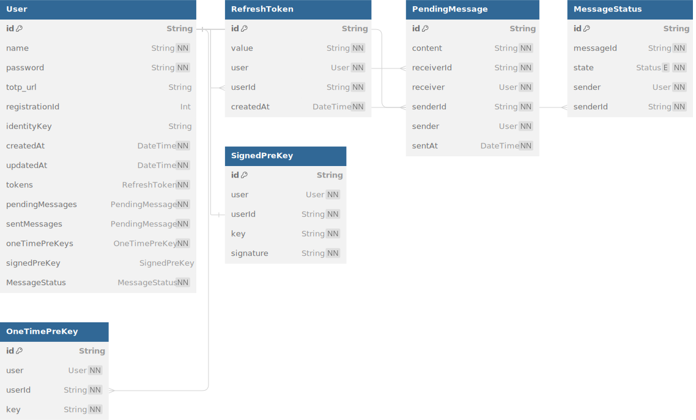

# Fonctionnement

Le fonctionnement de Missive repose sur l'efficacité du protocole Signal, qui est décrit [sur cette page](https://signal.org/docs/). Vous trouverez ci-dessous un schéma d'utilisation classique, de la création du compte utilisateur à l'envoi et la réception d'un message.


## Cas d'utilisation

Pour mieux comprendre le fonctionnement global, nous allons étudier un cas d'utilisation typique, de la création du compte utilisateur à l'envoi et la réception d'un message. 

### Création du compte

La création du compte s'effectue de la manière suivante : l'utilisateur rentre ses informations, et les confirme. Un ID d'enregistrement et une paire de clés d'identités sont générées. Toutes ces informations sont ensuite envoyées à l'API (seulement la partie publique de la clé). L'API vérifie que les informations sont correctes, puis crée un compte utilisateur. Après la confirmation de la création du compte, le reste des clés nécessaires au fonctionnement du protocole sont ensuite générées, envoyées à l'API, et stockées en base de données.

{ width="350" }

Un jeton d'accès et de rafraîchissement sont ensuite envoyés à l'utilisateur, qui lui permet de se connecter à l'application, ainsi que de rafraîchir son jeton d'accès, qui a une durée de vie de 15 minutes. Ce jeton de rafraîchissement est crucial car il est stocké en base de données avec l'ID de l'utilisateur, et peut donc être révoqué en cas de perte ou de vol du compte.


Une fois le compte de l'utilisateur créé, il est redirigé sur la page d'accueil de l'application, d'où commence la prochaine étape, la génération des clés.

### Génération des clés

Une fois que l'utilisateur arrive sur la page d'accueil, que ce soit après la création de son compte ou après s'être connecté, une vérification du statut de l'application est effectuée. Si ce compte vient d'être accédé pour la première fois sur ce périphérique, alors une génération des clés s'effectue. Ce processus permet de s'assurer que les différentes clés soient bien disponibles, et qu'il n'y ait aucun conflit.


En résumé, les différentes clés privées et publiques sont générées, stockées dans le stockage sécurisé du système d'exploitation, puis envoyées à l'API pour être stockées en base de données. Il est nécessaire que tous les utilisateurs puissent avoir accès aux clés publiques d'un autre utilisateur afin d'établir une connexion et autorisation initiale. Une fois que les clés sont stockées, l'utilisateur peut commencer à envoyer et recevoir des messages.

{ width="350" }

### Début de la conversation

Quand un utilisateur•trice souhaite envoyer un message à un•e autre utilisateur•trice pour la première fois, il/elle dispose d'un bouton en haut à droite de l'application pour commencer une conversation. Il/elle rentre le nom de l'utilisateur•trice destinataire, qui sera cherché•e en temps réel dans la base de données. Une fois l'utilisateur•trice trouvé•e, une conversation est créée, stockée en local dans une base de données et l'utilisateur•trice peut envoyer un message. Cette dernière viendra également se rajouter sur la page d'accueil afin que l'utilisateur•trice puisse y accéder facilement.

{ width="350" }

### Envoi du message

Lorsque l'utilisateur•trice envoie un message, ce dernier est chiffré en utilisant le protocole Signal, puis envoyé au serveur de WebSocket. Ce dernier vérifie que l'utilisateur est bien connecté, puis envoie le message à l'utilisateur destinataire. Si ce dernier est connecté, le message est directement envoyé à l'utilisateur•trice. Sinon, le message est stocké en base de données, et sera récupéré dès que l'utilisateur•trice se connectera.
{ width="350" }

À la réception de ce message par le destinataire (la réception étant soit en temps réel si l'utilisateur est sur l'application, soit en différé s'il n'est pas connecté), l'envoyeur est directement notifié, et le changement de statut est reflété sur l'application par des petites coches à droite du message. Une notification push est également envoyée au destinataire pour lui indiquer qu'un nouveau message est disponible.

### Réception du message

Maintenant que l'expéditeur a envoyé son message, il est temps pour le destinataire de le récupérer. Ce dernier se connecte sur son application, ou l'ouvre simplement s'il est déjà connecté. Une vérification des messages en attente est effectuée à chaque démarrage de l'application. Si le destinataire a des messages en attente, ils sont récupérés depuis l'API, déchiffrés, et affichés à l'utilisateur. Cela permet de garantir que l'utilisateur ne rate aucun message, même s'il n'était pas connecté à l'application.

{ width="400" }

Dans le cas où l'utilisateur était déjà présent sur l'application, le message lui est directement envoyé, et est traité en temps réel par l'application.

Quand l'utilisateur lit le message (le message est affiché à l'écran, dans l'écran de conversation), un message de confirmation est envoyé à l'expéditeur pour lui indiquer que le message a bien été lu. Cette confirmation lui est soit envoyée directement s'il est sur l'application, soit stockée en base de données s'il n'est pas connecté, et sera récupérée dès qu'il se connectera.

## Architecture

L'application comporte trois parties distinctes : le client, qui est l'application mobile réalisée en Flutter, l'API, qui est une API REST en TypeScript, ainsi qu'un serveur de WebSocket, qui est lui aussi en TypeScript. Le client peut communiquer avec l'API pour la partie autorisation (gestion de la connexion à l'application, de l'authentification en 2 étapes...), ainsi que la réception des messages depuis le serveur si l'on était hors-ligne, et avec le serveur de WebSocket pour la partie communication en temps réel. Vous trouverez ci-dessous un schéma de l'architecture de l'application.


1. Le client envoie un message à un•e utilisateur•trice via son application. Ce message est chiffré au niveau de l'application grâce au protocole Signal.
2. Le message est envoyé grâce à une connexion WebSocket au serveur.
3. Le serveur vérifie l'authentification et les permissions de l'utilisateur•trice grâce au jeton d'accès, puis regarde si la•le destinataire est connecté•e.

    - Si la•le destinataire est connecté•e, le message est envoyé directement à l'utilisateur•trice.
    - Si la•le destinataire n'est pas connecté•e, le message est stocké dans la base de données, et sera envoyé dès que la•le destinataire se connectera. Une notification est également envoyée.

4. L'utilisateur•trice reçoit le message, qui est déchiffré au niveau de l'application grâce au protocole Signal.
    1. Au démarrage de l'application, l'utilisateur•trice se connecte à l'API pour récupérer les messages en attente.

Le fonctionnement technique de ces différentes parties est détaillé ci-dessous.

### Client

Le client est l'application mobile, réalisée en Flutter. Il est le point d'entrée de l'utilisateur·rice, et permet de communiquer avec l'API et le serveur de WebSocket. Il permet aussi de gérer le chiffrement, le déchiffrement, et la signature des messages. Flutter a été retenu pour sa rapidité de développement, son expérience développeur, sa facilité de déploiement, et sa capacité à gérer les différentes plateformes (iOS, Android, Web, Desktop). Il permet également de gérer les mises à jour de manière efficace, et de gérer les différentes versions de l'application.

#### Concepts Flutter

Avant de commencer à parler du fonctionnement de l'application, il est important de comprendre certains concepts de Flutter, qui est le framework utilisé pour le développement de l'application. Ces concepts vont beaucoup revenir par la suite.

##### Provider

Une application front-end doit gérer un état global, qui permet de gérer les différentes parties de l'application. Par exemple, dans le cas de Missive, il faut un moyen de gérer les différentes clés, les messages, les utilisateurs, etc. Il faut également que l'application puisse réagir à certains de ces événements (ie. réception d'un message, envoi d'un message, etc.).

Pour palier à ce problème, Flutter propose un système de gestion de l'état global, appelé Provider. Ce dernier permet de gérer l'état global de l'application, et de le partager entre les différentes parties de l'application. Un Provider est une classe, qui étend la classe `ChangeNotifier`, et qui permet de notifier les différentes parties de l'application lorsqu'un changement d'état a lieu.

Pour Missive, trois Provider sont disponibles :

- `AuthProvider` : permet de gérer l'authentification de l'utilisateur·rice, ainsi que son compte utilisateur.
- `SignalProvider` : propose une interface plus haut niveau de mon implémentation du protocole Signal, et permet de chiffrer, déchiffrer, et signer les messages. Il interagit également avec le SecureStorage pour stocker les clés de manière sécurisée (sérialisation / désérialisation).
- `ChatProvider` : permet de gérer la communication en temps réel avec le serveur de WebSocket.


Provider a été retenu pour sa simplicité, et la possibilité de séparer clairement la logique de l'interface de manière efficace.

##### flutter_secure_storage

flutter_secure_storage est une bibliothèque Flutter qui permet de persister des données de manière sécurisée dans le stockage sécurisé du système d'exploitation (Keychain pour iOS, Keystore pour Android, libsecret pour les systèmes Linux). Elle est une partie extrêmement cruciale de Missive, car elle est utilisée dans les stores de mon implémentation du protocole Signal afin de récupérer les clés, sessions et autres données sensibles.

Les données sont stockées en base64 après avoir été sérialisées, car le stockage sécurisé ne permet que le stockage de chaînes de caractères. Il y a donc tout un travail de sérialisation/désérialisation à faire pour stocker des objets plus complexes, sur lequel nous allons revenir plus tard.

Il permet également de stocker les clés de plusieurs utilisateurs, car il préfixe chaque clé avec le nom de l'utilisateur grâce à `NamespacedSecureStorage`, une classe dérivée de `flutter_secure_storage`. Cela permet de gérer plusieurs comptes sur la même application, et de les isoler les uns des autres afin d'éviter les problèmes et les conflits.

#### Arborescence

```sh
client/lib
├── common
│   └── http.dart
├── constants
│   ├── api.dart
│   └── app_colors.dart
├── features
│   ├── authentication
│   │   ├── landing_screen.dart
│   │   ├── login_screen.dart
│   │   ├── models
│   │   │   └── user.dart
│   │   ├── providers
│   │   │   └── auth_provider.dart
│   │   ├── register_screen.dart
│   │   └── totp_modal.dart
│   ├── chat
│   │   ├── models
│   │   │   ├── conversation.dart
│   │   │   ├── conversation.realm.dart
│   │   │   ├── pending_messages.dart
│   │   │   └── pending_messages.realm.dart
│   │   ├── providers
│   │   │   └── chat_provider.dart
│   │   └── screens
│   │       ├── conversation_screen.dart
│   │       ├── conversations_screen.dart
│   │       ├── message_bubble.dart
│   │       └── user_search_screen.dart
│   └── encryption
│       ├── namespaced_secure_storage.dart
│       ├── providers
│       │   └── signal_provider.dart
│       ├── secure_storage_identity_key_store.dart
│       ├── secure_storage_pre_key_store.dart
│       ├── secure_storage_session_store.dart
│       └── secure_storage_signed_pre_key_store.dart
├── firebase_options.dart
└── main.dart
```
Arborescence de l'application

Comme vous pouvez le voir, l'application est divisée en plusieurs parties, en utilisant l'approche *feature-first* : chaque fonctionnalité a son propre dossier, et est organisée de la même manière, avec les écrans séparés des providers. Cela permet de voir rapidement les différentes parties de l'application, de séparer au maximum la logique de l'interface, et m'a beaucoup aidé lors du développement.

Ces différentes parties sont ensuite importées dans le fichier `main.dart`, qui est le point d'entrée de l'application. Il contient le routeur, importe tous les providers afin d'y avoir accès dans toute l'application, et redirige les utilisateurs par rapport à leur état de connexion.

#### Protocole Signal

Le protocole Signal, qui a été retenu pour sa fiabilité, son excellente documentation en ligne ainsi que ses implémentations en un grand nombre de différents langages, est implémenté grâce à la bibliothèque `libsignal_protocol_dart`. Cette dernière nous permet d'avoir une implémentation personnalisée du protocole, dans le sens où elle nous permet de gérer le stockage des différentes clés et sessions de la manière que l'on souhaite.

Cette bibliothèque fonctionne en deux parties :

##### Implémentation des stores

 Premièrement, il faut s'occuper d'implémenter les stores. Ces derniers sont les classes qui vont interagir avec le stockage de notre choix. Des classes abstraites sont fournies, `IdentityKeyStore`, `PreKeyStore`, `SessionStore`, `SignedPreKeyStore`, qui détaillent les différentes méthodes à implémenter afin que le protocole puisse fonctionner. Une fois ces dernières fonctionnelles, il est possible de les passer en paramètre à d'autres classes, sur lesquelles nous allons revenir plus tard.

 Dans le  cas de Missive, le stockage qui a été choisi est `flutter_secure_storage`, qui permet de stocker les clés de manière sécurisée dans le stockage sécurisé du système d'exploitation. Il est important de noter que les clés sont sérialisées en base64 avant d'être stockées, car le stockage sécurisé ne permet que le stockage de chaînes de caractères.

Prenons l'exemple de `PreKeyStore`, qui permet de gérer les pré-clés, à savoir les clés qui sont utilisées pour établir une session de chiffrement avec un autre utilisateur. Dans la version en Dart, il est nécessaire d'avoir une classe qui implémente les méthodes suivantes :

- `containsPreKey` : permet de vérifier si une pré-clé est déjà stockée
- `loadPreKey` : permet de charger une pré-clé stockée
- `removePreKey` : permet de supprimer une pré-clé stockée
- `storePreKey` : permet de stocker une pré-clé

Voici un exemple d'implémentation de `PreKeyStore`, plus précisément de la méthode loadPreKey :

```dart
class SecureStoragePreKeyStore implements PreKeyStore {
  final SecureStorage _secureStorage;

  SecureStoragePreKeyStore(SecureStorage secureStorage)
      : _secureStorage = secureStorage;


  /// Loads a serialized [PreKeyRecord] from [SecureStorage] and returns it as a [PreKeyRecord].
  /// Throws an [InvalidKeyIdException] if the pre key is not found.
  @override
  Future<PreKeyRecord> loadPreKey(int preKeyId) async {
    final preKeys = await _loadKeys();

    if (preKeys == null) {
      throw InvalidKeyIdException('There are no preKeys stored');
    }

    final preKey = preKeys[preKeyId.toString()];
    if (preKey == null) {
      throw InvalidKeyIdException('PreKey with id $preKeyId not found');
    }

    // Decode the base64 string and deserialize it as a PreKeyRecord
    return PreKeyRecord.fromBuffer(base64Decode(preKey));
  }

  /// Loads all pre keys from the secure storage
  /// Returns a [Map] of [PreKeyRecord]s
  Future<Map<String, dynamic>?> _loadKeys() async {
    final preKeysJson = await _secureStorage.read(key: 'preKeys');
    if (preKeysJson == null) return null;
    final preKeys = jsonDecode(preKeysJson);

    return preKeys;
  }

  // Autres méthodes (storePreKey, removePreKey, containsPreKey)...
}
```
Exemple d'implémentation du store PreKeyStore

Comme vous pouvez le voir, la méthode loadPreKey s'occupe de désérialiser les clés depuis le stockage sécurisé, et de les renvoyer sous forme de PreKeyRecord, qui est un objet de la bibliothèque `libsignal_protocol_dart`.

Les différents stores sont disponibles dans le dossier `client/features/encryption`.

##### Utilisation des stores

Une fois les stores implémentés, il est possible de les utiliser dans les différentes parties de l'application. `libsignal_protocol_dart` fournit des classes qui permettent d'être instanciées en utilisant les stores, ce qui assure une cohérence dans l'application, ainsi qu'une grande facilité d'utilisation une fois les stores fonctionnels.

Missive simplifie l'utilisation de ces classes en utilisant un Provider, `

SignalProvider`, qui permet de gérer le chiffrement et le déchiffrement de messages. Nous allons voir un exemple d'utilisation de`SignalProvider` pour chiffrer un message :

```dart
class SignalProvider extends ChangeNotifier {
    late SecureStorageIdentityKeyStore _identityKeyStore;
    late SecureStoragePreKeyStore _preKeyStore;
    late SecureStorageSignedPreKeyStore _signedPreKeyStore;
    late SecureStorageSessionStore _sessionStore;

    Future<void> initialize(
      {required bool installing,
      required String name,
      String? accessToken}) async {
        // Initialisation des stores (cette méthode doit être appelée avant d'utiliser les autres méthodes)
        ...
      }
      
    Future<CiphertextMessage> encrypt(
      {required String name, required String message}) async {
        final remoteAddress = SignalProtocolAddress(name, 1);
        final sessionCipher = SessionCipher(_sessionStore, _preKeyStore,
            _signedPreKeyStore, _identityKeyStore, remoteAddress);

        final cipherText = await sessionCipher.encrypt(utf8.encode(message));
        return cipherText;
    }
}
```
Méthode encrypt de SignalProvider

Comme vous pouvez le voir, la méthode `encrypt` utilise les différents stores pour chiffrer un message, en instanciant un `SessionCipher`. Cette classe est la classe principale de la bibliothèque, et permet de chiffrer / déchiffrer les messages en utilisant les différentes clés stockées dans les stores. Elle s'occupe automatiquement d'utiliser les différentes méthodes des stores pour récupérer les clés nécessaires, et de les utiliser pour chiffrer le message.

##### SignalProvider

Afin de simplifier tout ce processus, un Provider a été créé afin d'envelopper les méthodes et la logique plus bas niveau du protocole Signal. Ce dernier contient des méthodes permettant d'effectuer les opérations principales dont Missive a besoin (initialisation du protocole ainsi que des stores, récupération des pré-clés, chiffrement / déchiffrement des messages). Cela permet d'avoir une interface simple afin d'utiliser le protocole, et de séparer encore plus la logique de l'interface afin d'éviter d'avoir des composants trop longs et complexes.


##### Initialisation du protocole

À chaque fois que l'utilisateur lance l'application, le protocole est initialisé, en utilisant la fonction `initialize({required bool installing, required String name, String? accessToken})`. Le fonctionnement de cette dernière est le suivant : 


Une fois le protocole initialisé, `SignalProvider` est prêt à être utilisé. Si ce dernier ne l'est pas, une erreur sera retournée afin d'éviter tout comportement non attendu.

##### Établissement d'une session

Le protocole Signal requiert l'établissement d'une session entre deux utilisateur•trice•s afin de pouvoir envoyer et recevoir des messages chiffrés. Ce processus est abstrait dans la fonction `buildSession(name: 'username', accessToken: 'access-token')`. Cette dernière est appelée à chaque fois qu'une conversation est accédée, ou si un message est reçu sans qu'une session soit disponible (si c'est le premier message que l'on reçoit de cet•te utilisateur•trice). Voici comment elle fonctionne :

- Vérifie si une session existe déjà dans notre implémentation du `SessionStore`
- Récupération du bundle de pré-clés avec `GET /users/{name}/keys
- Instanciation d'un SessionBuilder avec les différents stores, ainsi que l'addresse de l'utilisateur (en l'occurence son nom)
- Traitement du bundle de pré-clés

Une fois toutes ces étapes effectuées, le SessionBuilder se chargera automatiquement de créer la session avec nos implémentations des différents stores (ceci est également la raison de pourquoi il est si important de bien les implémenter), du moment que nos méthodes font ce qu'elles sont sensées faire.

#### Authentification

L'authentification de Missive est gérée par le provider `AuthProvider`. Ce dernier permet de connecter l'utilisateur, en interagissant avec l'API afin de récupérer les jetons d'accès et de rafraîchissement. Il permet aussi de gérer la création de compte, et la déconnexion.

##### AuthProvider
La connexion et la création de compte s'effectue en envoyant une requête à l'API (`POST /users` pour la création de compte, `POST /tokens` pour la connexion). Si la connexion est réussie, les jetons d'accès et de rafraîchissement sont stockés dans le stockage sécurisé, et l'utilisateur est redirigé vers la page des conversations. Tout ce comportement est enveloppé par la fonction `login(String name, String password)`. Cette dernière fonctionne de cette manière : 


Il est important de noter que `register()` fonctionne quasiment de la même manière, la différence étant que la requête sera à `POST /users` et non `POST /tokens`.
###### Gestion des erreurs d'authentification

Les erreurs d'authentification sont gérées par des classes qui sont retournées par les fonctions d'authentification. J'ai décidé de baser mon système de gestion d'erreurs sur le type de l'objet plutôt qu'avec un statut quelque part dans l'objet, car le système de typage de Dart rend ce procédé beaucoup plus propre.

Nous avons d'un côté la classe `AuthenticationSuccess`, qui représente une authentification avec les bons identifiants ou une création de compte qui a fonctionnée. De l'autre, nous avons `AuthenticationError`, une classe abstraite dont plusieurs autres classes héritent. Elle hérite de la classe `Error` par défaut de Dart, et nous permet d'avoir une interface commune et standarde à toutes ces erreurs. Si une de ces erreurs est retournée, le client pourra donc gérer le message à afficher au client en vérifiant le type de l'objet retourné. On peut apercevoir ce procédé dans l'implémentation de `login_screen.dart` et `register_screen.dart`.

###### Authentification des requêtes

Une fois la connexion / la création de compte effectuée, les autres requêtes qui seront effectuées vers le serveur pourront désormais être authentifiées avec le jeton d'accès et de rafraîchissement stockés dans le stockage sécurisé. Ils sont récupérés à l'aide de *getters* dans le `AuthProvider`, qui rendent le procédé beaucoup plus propre car le *getter* `accessToken` rafraîchit automatiquement le jeton d'accès si il venait à expirer, en décodant la base64 et en vérifiant la date d'expiration avec la date de l'appareil.

##### Routage 
Le routage des pages est effectuée en utilisant `go_router`, qui permet de rediriger l'utilisateur•trice sur la page d'accueil de son compte dès qu'il•elle s'authentifie, ainsi que de s'occuper d'envoyer l'utilisateur sur les différentes pages de l'application comme la page d'une conversation, l'écran de recherche etc. `AuthProvider` étant ce qu'on appelle un *listenable* en Dart (un élément depuis lequel un autre peut réagir), à chaque fois que `notifyListeners()` est appelé (dans le cas de `AuthProvider`, après une connexion  / création de compte qui a fonctionné), la logique définie dans `_router.refresh`, présente dans l'entrypoint de mon application, `main.dart` est lancée. Voici à quoi elle ressemble : 

```dart
redirect: (context, state) async {
      // Determine if the user is in the onboarding flow (trying to login or register)
      bool onboarding = state.matchedLocation == '/login' ||
          state.matchedLocation == '/register' ||
          state.matchedLocation == '/landing';
      if (!authProvider.isLoggedIn) {
        return onboarding ? null : '/landing';
      }

      return onboarding ? '/' : null;
    },
    refreshListenable: authProvider
```
Logique de redirection du routeur de Missive

Si la connexion échoue, une erreur est affichée à l'utilisateur (grâce au type de retour de `login()` et `register()`), et il lui est demandé de réessayer.

#### Conversations

La gestion des conversations est effectuée grâce à `ChatProvider`. Ce dernier contient  

##### Communication en temps réel

La communication en temps réel est gérée par le provider `ChatProvider`. Ce dernier permet de gérer la connexion au serveur de WebSocket, ainsi que l'envoi et la réception des messages. Il permet également de gérer les différentes erreurs qui peuvent survenir lors de la communication. Il dépend de `SignalProvider` pour chiffrer et déchiffrer les messages, ainsi que de `AuthProvider` pour récupérer les jetons d'accès, comme par exemple afin d'établir la connexion au serveur WebSocket, ou pour récupérer les messages en attente.

### Serveur

Le serveur de Missive est composé de deux parties distinctes : l'API, et le serveur WebSocket. Ces deux parties permettent de gérer l'authentification, l'autorisation, le stockage des messages, et la communication en temps réel entre les utilisateur·rice·s. Ils sont réalisés à l'aide du framework Fastify, qui est un framework back-end rapide, et qui permet de gérer les différentes routes de manière efficace. Il permet également de gérer les différentes parties de l'application de manière découplée, ce qui est crucial dans le développement de cette application.

#### Concepts Fastify

Avant de commencer à détailler le fonctionnement du serveur, il est important de comprendre les concepts de base de Fastify, qui est le framework utilisé pour l'API et le serveur de WebSocket, car la nomenclature sera utilisée dans la suite de la documentation.

##### Hooks

Les hooks Fastify sont des fonctions qui sont exécutées avant ou après une route. Ils permettent de gérer des opérations comme l'authentification, la validation des données, la vérification des permissions, etc. Ils sont très utiles pour gérer les différentes parties de l'application, et permettent de découpler les différentes parties de l'application. Ce sont l'équivalent des middlewares dans d'autres frameworks.

#### API

L'API est une API REST en TypeScript, qui permet de gérer l'authentification, le stockage des différentes clés publiques, ainsi que les utilisateurs. Le framework utilisé pour cette dernière sera Fastify, qui est un framework back-end rapide, qui permet de gérer les routes de manière efficace. Beaucoup de fonctionnalités sont déjà implémentées, comme la gestion des erreurs, la gestion des paramètres, etc. Cela me permettra de me concentrer au maximum sur le développement de l'application et de ses fonctionnalités.

La base de données est gérée par Prisma, qui est un ORM (Object-Relational Mapper) permettant de gérer les différentes tables de manière efficace, et de gérer les relations entre les différentes tables. Il permet également de gérer les migrations de manière efficace, et de gérer les différentes versions de la base de données (ce qui est crucial durant le processus de développement).

##### Authentification

Le système d'authentification de l'API repose sur un système de jetons JWT. Ces derniers permettent une gestion de l'authentification complètement découplée du serveur (ce qui est important pour une API REST, qui doit rester *stateless*).

Après la connexion à l'application (route `POST /users`), l'utilisateur·rice reçoit :

- Jeton d'accès : permet de s'authentifier sur les différentes routes de l'API. Il est valide pendant 15 minutes, et contient les différentes permissions de l'utilisateur·rice. Il est envoyé dans le corps de la réponse, et doit être stocké localement de manière sécurisée.
- Jeton de rafraîchissement : permet de rafraîchir le jeton d'accès. Il est valide pendant 30 jours, et permet de générer un nouveau jeton d'accès sans avoir à se reconnecter. Il permet également de révoquer la connexion en cas de perte ou de vol du compte. Il est envoyé dans un cookie sécurisé HTTPOnly, et doit être stocké localement de manière sécurisée.

Le contenu d'un jeton d'accès est le suivant :

```json
{
  "scope": [
    "profile:read",
    "profile:write",
    "keys:read",
    "messages:read"
  ],
  "iat": 1712660971,
  "sub": "aed060ac-75d5-44df-a82e-760b3d1d6636",
  "exp": 1712661871
}
```
Contenu d'un jeton d'accès

- `scope` : les différentes permissions de l'utilisateur·rice
- `iat` : l'heure à laquelle le jeton a été émis (issued at)
- `sub` : l'identifiant unique de l'utilisateur·rice
- `exp` : l'heure à laquelle le jeton expire

Le jeton de rafraîchissement contient uniquement l'identifiant unique de l'utilisateur, ainsi que sa date d'expiration.

Ces derniers étant signés cryptographiquement via une clé privée, il est impossible de les modifier sans la clé privée correspondante. Cela permet de garantir l'intégrité des jetons, et de garantir que l'utilisateur·rice est bien celui·celle qu'il·elle prétend être. Cela permet également de ne pas avoir à gérer des sessions côté serveur, et laisse au client la responsabilité de gérer son propre état.


Le processus d'authentification est géré par le hook `authenticationHook`.

##### Autorisation

Le processus d'autorisation de Missive repose sur un système de permissions. Chaque utilisateur·rice possède un ensemble de permissions, qui lui permettent d'accéder à certaines routes de l'API. Ces permissions sont stockées dans le jeton d'accès, et sont vérifiées à chaque requête. Si l'utilisateur·rice n'a pas les permissions nécessaires pour accéder à une route, il·elle recevra une erreur 403 Forbidden.

Voici le champ en question, qui a déjà été mentionné dans la partie Authentification :

```json
{
    "scope": [
        "profile:read",
        "profile:write",
        "keys:read",
        "messages:read"
    ]
}
```
Scope d'un jeton d'accès

Le processus d'autorisation est géré par le hook `authorizationHook`, qui prend également en paramètre les permissions nécessaires pour accéder à une route.


#### Serveur WebSocket

Le serveur WebSocket est un serveur en TypeScript, qui permet de gérer la communication en temps réel entre les utilisateur·rice·s. Il permet de gérer l'envoi des messages, ainsi que leur stockage si nécessaire. La bibliothèque utilisée pour ce dernier est un plugin Fastify, [@fastify/websocket](https://www.npmjs.com/package/@fastify/websocket), qui encapsule le protocole WebSocket et permet d'utiliser les fonctionnalités de Fastify.

Ce dernier utilise le même système d'authentification que l'API (jeton d'accès) à la création de la connexion. Il peut également accéder à la base de données, ce qui lui permet de stocker les messages temporairement dans le cas où l'utilisateur·rice n'est pas connecté·e.

Il

 permet d'envoyer des messages à un utilisateur•trice en utilisant son identifiant, ainsi que d'en recevoir et de gérer les statuts de lecture et de réception.

##### Authentification / autorisation

Comme expliqué auparavant, le serveur de Websocket emploie le même procédé de vérification d'identité et de permissions que l'API. Les jetons étant signés avec une clé privée propre au serveur, la vérification de l'identité utilise la même clé publique que l'API. Ce dernier a également accès à la même base de données, car l'instance de Prisma est partagée entre les deux parties du serveur.

##### Création du WebSocket

Le WebSocket est créé en effectuant une requête HTTP classique à la route `/`, qui est ensuite transformée en WebSocket. Cette route est protégée par le hook `authenticationHook`, qui vérifie l'authentification de l'utilisateur·rice. Si l'utilisateur·rice est authentifié·e, le serveur accepte la connexion, et permet à l'utilisateur·rice de communiquer en temps réel avec les autres utilisateur·rice·s.

##### Envoi et réception de messages

Une fois la connexion établie, l'utilisateur·rice peut envoyer des messages à un autre utilisateur·rice en utilisant son identifiant unique. Le serveur vérifie que l'utilisateur·rice est bien connecté·e, et que l'utilisateur·rice destinataire est également connecté·e. Le corps du message qui doit être envoyé ressemble à ceci :

```json
{
    "receiverId": "5443f5ef-9b6d-438b-9c0f-e00298725d13",
    "content": "This is an encrypted test message"
}
```
Structure d'un message

Des informations sont ensuite ajoutées au message :

- L'identifiant de l'expéditeur
- L'heure d'envoi

Si l'utilisateur est connecté, le message est envoyé directement à l'utilisateur·rice destinataire, sans passer par la base de données. Un message de confirmation est ensuite envoyé à l'expéditeur pour lui indiquer que le message a bien été remis.

Si ce n'est pas le cas, le message est stocké dans la base de données, et sera envoyé à l'utilisateur·rice dès qu'il·elle se connectera. Après le stockage, un message de confirmation est ensuite envoyé à l'expéditeur pour lui indiquer que le message a bien été envoyé. La sécurité des données des utilisateur•trice•s est garantie par le chiffrement de bout en bout, ainsi que WSS, grâce à TLS, qui permet d'avoir une protection au niveau du contenu même du message et du transport. Les messages sont également supprimés de la base de données une fois qu'ils ont été demandés par le destinataire.


##### Gestion des statuts de messages

Au niveau du serveur, le WebSocket permet également de publier des mises à jour de statuts de messages, qui sont à ce format-ci :

```json
{
    "messageId": "5443f5ef-9b6d-438b-9c0f-e00298725d13",
    "state": "received",
    "sender": "alice"
}
```
Structure d'un message de statut

Ces dernières permettent aux clients de mettre à jour le statut de leur message. Il y a trois états possibles :

- `sent` : le message a été envoyé
- `received` : le message a été reçu
- `read` : le message a été lu

Ils peuvent être soit envoyés directement depuis le serveur, dans le cas d'un envoi de message (afin d'avertir l'envoyeur que son message a bien été reçu), soit envoyés par le client, dans le cas de la lecture d'un message. Ces derniers sont soit :

- Si l'utilisateur•trice est en ligne, envoyés directement au client
- Si l'utilisateur•trice est hors-ligne, stockés en base de données, et récupérés dès que l'utilisateur•trice se connecte

C'est un processus qui est similaire à celui de l'envoi de messages, mais qui utilise une table complètement différente, à savoir `MessageStatus`, afin d'éviter de garder les messages en base de données. Cela permet d'augmenter encore plus la sécurité des données des utilisateur•trice•s.

### Base de données

La base de données est une base de données PostgreSQL, qui permet de stocker les utilisateur•trice•s, les messages non envoyés et les clés publiques. PostgreSQL a été retenu pour sa robustesse, sa fiabilité, et sa capacité à gérer de gros volumes de données. Il permet également de gérer les transactions, les clés étrangères, et les index de manière efficace. Un diagramme de la base de données est disponible ci-dessous :

{ width=800 loading=lazy }

La base de données est gérée par Prisma, qui est un ORM (Object-Relational Mapper) permettant de gérer les différentes tables de manière efficace, et de gérer les relations entre les différentes tables, en représentant les tables sous forme d'un schéma générique, qui peut être ensuite converti en un grand nombre de types de base de données.

Le choix d'une base de données SQL a été fait car il n'y avait aucune nécessité pour un modèle NoSQL, les données et les relations étant clairement définies et structurées.

#### Explication du schéma

##### User

La table `User` permet de stocker les différents utilisateur•trice•s de l'application. Elle contient les informations suivantes :

| Colonne           | Description                                                                                                                                                                              |
| ----------------- | ---------------------------------------------------------------------------------------------------------------------------------------------------------------------------------------- |
| `id`              | l'identifiant unique de l'utilisateur•trice (UUID généré automatiquement, permet d'éviter les collisions et d'itérer sur les utilisateurs)                                               |
| `name`            | le nom d'utilisateur•trice (unique, sert également à identifier l'utilisateur•trice dans les différents cas où c'est la seule information que l'on a)                                    |
| `password`        | le mot de passe de l'utilisateur•trice (hashé, pour des raisons de sécurité, en utilisant Argon2)                                                                                        |
| `totp_url`        | l'URL du TOTP (Time-based One-Time Password) de l'utilisateur•trice, qui permet de générer un code à usage unique pour la double authentification                                        |
| `registrationId`  | l'identifiant de l'enregistrement de l'utilisateur•trice. Fait partie du protocole Signal                                                                                                |
| `identityKey`     | la clé d'identité publique de l'utilisateur•trice. Fait partie du protocole Signal                                                                                                       |
| `createdAt`       | la date de création de l'utilisateur•trice                                                                                                                                               |
| `updatedAt`       | la date de dernière mise à jour de l'utilisateur•trice                                                                                                                                   |
| `tokens`          | les différents jetons de rafraîchissement de l'utilisateur•trice (permet de révoquer les connexions en cas de perte ou de vol du compte)                                                 |
| `pendingMessages` | les messages en attente de l'utilisateur•trice (stockés en base de données, et récupérés dès que l'utilisateur•trice se connecte)                                                        |
| `sentMessages`    | les messages envoyés par l'utilisateur•trice                                                                                                                                             |
| `oneTimePreKeys`  | les clés pré-clés à usage unique de l'utilisateur•trice. Fait partie du protocole Signal. Utilisées afin d'établir une session de chiffrement initiale avec un•e autre utilisateur•trice |
| `signedPreKey`    | la clé pré-clé signée de l'utilisateur•trice. Fait partie du protocole Signal                                                                                                            |
| `MessageStatus`   | les différents statuts des messages de l'utilisateur•trice (envoyé, reçu, lu)                                                                                                            |

##### RefreshToken

La table `RefreshToken` permet de stocker les différents jetons de rafraîchissement des utilisateur•trice•s. Elle contient les informations suivantes :

| Colonne  | Description                                                                                                            |
| -------- | ---------------------------------------------------------------------------------------------------------------------- |
| `id`     | l'identifiant unique du jeton de rafraîchissement (UUID généré automatiquement)                                        |
| `userId` | l'identifiant de l'utilisateur•trice auquel appartient le jeton de rafraîchissement                                    |
| `value`  | la valeur du jeton de rafraîchissement (unique, permet de révoquer les connexions en cas de perte ou de vol du compte) |

Cette table contient le minimum d'informations possibles, afin d'éviter de stocker une session côté serveur, et de garantir que l'application reste *stateless* le plus possible. Cela allège le travail du serveur et laisse la responsabilité au client de gérer son propre état, ce qui dans le cas de Missive, est un choix pertinent pour garantir la sécurité des données des utilisateur•trice•s.

##### SignedPreKey

La table `SignedPreKey` permet de stocker les différentes clés pré-clés signées des utilisateur•trice•s. Il y en a une seule par utilisateur•trice. Elle contient les informations suivantes :

| Colonne  | Description                                                                 |
| -------- | --------------------------------------------------------------------------- |
| `id`     | l'identifiant unique de la clé pré-clé signée (UUID généré automatiquement) |
| `userId` | l                                                                           |

'identifiant de l'utilisateur•trice auquel appartient la clé pré-clé signée                                                                  |
| `keyId`     | l'identifiant unique de la clé pré-clé signée (généré automatiquement, fait partie du protocole Signal)                                        |
| `publicKey` | la clé publique de la clé pré-clé signée (permet d'établir une session de chiffrement initiale avec un•e autre utilisateur•trice)             |
| `signature` | la signature de la clé pré-clé signée (permet de vérifier l'authenticité de la clé pré-clé signée, et d'éviter les attaques de type MITM)      |
| `createdAt` | la date de création de la clé pré-clé signée                                                                                                   |

##### OneTimePreKey

La table `OneTimePreKey` permet de stocker les différentes clés pré-clés à usage unique des utilisateur•trice•s. Elle contient les informations suivantes :

| Colonne     | Description                                                                                                                               |
| ----------- | ----------------------------------------------------------------------------------------------------------------------------------------- |
| `id`        | l'identifiant unique de la clé pré-clé à usage unique (UUID généré automatiquement)                                                       |
| `userId`    | l'identifiant de l'utilisateur•trice auquel appartient la clé pré-clé à usage unique                                                      |
| `keyId`     | l'identifiant unique de la clé pré-clé à usage unique (généré automatiquement, fait partie du protocole Signal)                           |
| `publicKey` | la clé publique de la clé pré-clé à usage unique (permet d'établir une session de chiffrement initiale avec un•e autre utilisateur•trice) |
| `createdAt` | la date de création de la clé pré-clé à usage unique                                                                                      |

##### PendingMessage

La table `PendingMessage` permet de stocker les différents messages en attente des utilisateur•trice•s. Elle contient les informations suivantes :

| Colonne     | Description                                                                |
| ----------- | -------------------------------------------------------------------------- |
| `id`        | l'identifiant unique du message en attente (UUID généré automatiquement)   |
| `userId`    | ldentifiant de l'utilisateur•trice auquel appartient le message en attente |
| `senderId`  | l'identifiant de l'utilisateur•trice qui a envoyé le message en attente    |
| `content`   | le contenu du message en attente (chiffré, pour des raisons de sécurité)   |
| `createdAt` | la date de création du message en attente                                  |

##### MessageStatus

La table `MessageStatus` permet de stocker les différents statuts des messages. Elle contient les informations suivantes :

| Colonne     | Description                                                                 |
| ----------- | --------------------------------------------------------------------------- |
| `id`        | l'identifiant unique du statut de message (UUID généré automatiquement)     |
| `userId`    | l'identifiant de l'utilisateur•trice auquel appartient le statut de message |
| `messageId` | l'identifiant du message auquel appartient le statut de message             |
| `state`     | l'état du message (envoyé, reçu, lu)                                        |
| `createdAt` | la date de création du statut de message                                    |
| `updatedAt` | la date de dernière mise à jour du statut de message                        |

## Intégration continue 

Missive possède une pipeline d'intégration continue, gérée par un fichier `.gitlab-ci.yml`. Ce dernier est configuré pour être activé à chaque push la branche `main`, et se charge d'effectuer les opérations suivantes : 

1. Tests unitaires du serveur
2. Tests unitaires du client
3. Génération de la documentation d'API du client
4. Génération de la documentation mkdocs
5. Déploiement sur pages

Les tests unitaires du serveur et du client se déclenchent seulement si il y a eu des changements dans leurs dossiers respectifs, afin d'éviter d'effectuer des pipelines redondantes. Il n'a pas été possible de faire la même chose pour la documentation du client et du serveur, car ces derniers dépendent l'un de l'autre (la documentation du client se situe dans un sous-dossier du Gitlab Pages du serveur, afin de pouvoir être accessible facilement via le même domaine).

## Déploiement 

Le déploiement du serveur de Missive s'effectue à l'aide de Docker, qui a été retenu pour sa facilité à maintenir et pour sa capacité à recréer des environnements reproducibles. Un `Dockerfile` est présent dans le répertoire `server`, qui permet de générer une image du serveur.

Une fois cette image générée, un `docker-compose.yml` est présent à la racine du projet. Ce dernier comporte deux variantes :

- Développement (`docker-compose.dev.yml`) : permet de lancer une instance en développement, avec *hot reload*
- Production (`docker-compose.prod.yml`) : permet de lancer une instance en production, avec HTTPS automatique

La raison pour laquelle ces deux dernières ont été séparées en plusieurs fichiers vient du fait des légères différences entre les environnements. Avec ce système, la version en développement peut bénéficier du *hot reload*, comme mentionné auparavant, ce qui améliore grandement l'expérience développeur. De plus, le déploiement en production nécéssitant HTTPS, qui a besoin d'un nom de domaine afin de générer les certificats, ce n'est donc pas possible de le faire si le serveur tourne sur localhost.

Ce Compose permet également aussi de lancer une base de données postgres, qui est migrée automatiquement grâce au script `migrate-and-run.sh` dans le dossier serveur. Ce dernier lance les bonnes migrations par rapport à l'environnement dans lequel il se trouve (migrations de développement en développement, qui active également les seeders présents, et migrations de production en production, qui permettent de s'assurer que les données ne seront pas supprimées si nous venions à mettre à jour le modèle). Les différentes variables d'environnements nécéssaires sont également définies, si besoin est.

Finalement, il lance un serveur Caddy, qui permet de gérer le reverse proxy vers les différentes applications, afin de pouvoir avoir le serveur et un client pgAdmin sur la même URL sans avoir besoin de changer le numéro de port.

Une des autres raisons pour laquelle les deux versions sont séparées est le fait que Docker Swarm est utilisé pour le déploiement de Missive. Ce dernier  est un outil de Docker, qui permet de rajouter des fonctionnalitées extrêmement pratiques pour le développement, comme la gestion des secrets de manière sécurisée (clés privées...), des configurations, et encore de pouvoir effectuer un *load balancing* automatiquement en connectant des nœuds ensemble.

### Jelastic Cloud

Le choix de l'hébergeur pour Missive a été Jelastic Cloud de chez Infomaniak. Ce dernier a été choisi car les données de Missive doivent se trouver en Suisse, afin de respecter la confidentialité des utilisateurs. De plus, ayant déjà une expérience antérieure avec les produits Infomaniak, le choix me semblait tout à fait naturel.

Jelastic Cloud est une *PaaS* (Platform as a Service), qui permet d'héberger facilement des applications. Un Docker Swarm a été créé chez eux, ainsi qu'une interface Portainer afin de pouvoir permettre une gestion du déploiement simple. Portainer possède également une fonctionnalité très appréciable, qui permet de donner le lien vers un dépôt Git contenant un `docker-compose.yml`, afin de pouvoir gérer automatiquement les différentes versions de l'application.

## Justifications techniques et réflexions

### Choix de Flutter

Flutter a été retenu pour plusieurs raisons :

1. **Rapidité de développement** : Flutter permet de développer des applications de manière très rapide, grâce à son hot reload, qui permet de voir les changements en temps réel. Cela permet de gagner énormément de temps lors du développement.
2. **Expérience développeur** : Flutter possède une excellente documentation, ainsi qu'une communauté très active. Cela permet de trouver des solutions aux problèmes rencontrés très rapidement. J'ai pu d'ailleurs discuter avec des membres de la communauté, via leur serveur Discord, pour résoudre des problèmes rencontrés lors du développement.
3. **Facilité de déploiement** : Flutter permet de déployer des applications sur plusieurs plateformes (iOS, Android, Web, Desktop) avec une seule *codebase*. Cela permet de gagner énormément de temps, et de garantir une expérience utilisateur homogène sur toutes les plateformes.
4. **Gestion des mises à jour** : Flutter permet de gérer les mises à jour de manière très efficace, grâce à son système de packages. Cela permet de mettre à jour l'application de manière très simple, et de garantir une expérience utilisateur optimale.
5. **Capacité à gérer les différentes plateformes** : Flutter permet de gérer les différentes plateformes de manière très simple, grâce à son système de widgets. Cela permet de garantir une expérience utilisateur optimale sur toutes les plateformes.

### Choix du protocole Signal

Le protocole Signal a été retenu pour plusieurs raisons :

1. **Fiabilité** : Le protocole Signal est utilisé par de nombreuses applications de messagerie sécurisée, comme WhatsApp, Signal, et Facebook Messenger. Cela permet de garantir une fiabilité optimale, et de s'assurer que les messages sont chiffrés de manière sécurisée.
2. **Documentation** : Le protocole Signal possède une excellente documentation, qui permet de comprendre son fonctionnement très rapidement. Cela permet de gagner énormément de temps lors du développement.
3. **Implémentations disponibles** : Le protocole Signal possède de nombreuses implémentations disponibles dans différents langages de programmation, ce qui permet de l'utiliser dans de nombreux contextes. Cela permet de garantir une flexibilité optimale, et de s'adapter à de nombreux environnements de développement.
4. **Sécurité** : Le protocole Signal permet de garantir une sécurité optimale, grâce à son chiffrement de bout en bout, le fait que chaque message est chiffré avec une clé différente, et à son système de signatures. Cela permet de garantir que les messages sont chiffrés de manière sécurisée, et que seul•e•s les utilisateur•rice•s peuvent les lire.

### Choix de Fastify

Fastify a été retenu pour plusieurs raisons :

1. **Rapidité** : Fastify est un framework back-end rapide, qui permet de gérer les routes de manière très efficace. Cela permet de garantir une performance optimale, et de s'assurer que les requêtes sont traitées de manière rapide.
2. **Gestion des erreurs** : Fastify permet de gérer les erreurs de manière très simple et unifiée grâce à son système de hooks. Cela permet de s'assurer que les erreurs sont gérées de manière efficace.
3. **Simplicité** : Fastify est un framework très simple à utiliser, qui permet de se concentrer au maximum sur le développement des fonctionnalités. Cela permet de gagner énormément de temps lors du développement, et de garantir une expérience développeur optimale.
4. **Extensions disponibles** : Fastify possède de nombreuses extensions disponibles, qui permettent de gérer des fonctionnalités avancées de manière très simple. Cela permet de garantir une flexibilité optimale, et de s'adapter à de nombreux environnements de développement.

### Choix de PostgreSQL

PostgreSQL a été retenu pour plusieurs raisons :

1. **Robustesse** : PostgreSQL est une base de données très robuste, qui permet de gérer de gros volumes de données de manière très efficace. Cela permet de garantir une performance optimale, et de s'assurer que les données sont stockées de manière sécurisée.
2. **Fiabilité** : PostgreSQL est une base de données très fiable, utilisée par de nombreuses entreprises pour stocker leurs données. Cela permet de garantir une fiabilité optimale, et de s'assurer que les données sont accessibles à tout moment.
3. **UUID en clé primaire** : PostgreSQL permet d'utiliser des UUID comme clés primaires, ce qui permet d'éviter les collisions, et de garantir que les identifiants sont uniques. Cela permet de garantir l'intégrité des données, et de s'assurer que les données sont stockées de manière cohérente. Cela permet également d'éviter que l'on puisse itérer les données, les identifiants étant simplement incrémentaux.

### Sécurité des données

La sécurité des données des utilisateur•rice•s est une priorité absolue pour Missive. Plusieurs mesures ont été mises en place pour garantir la sécurité des données :

1. **Chiffrement de bout en bout** : Les messages sont chiffrés de bout en bout, ce qui permet de garantir que seul•e•s les utilisateur•rice•s peuvent les lire. Cela permet de garantir la confidentialité des messages, et de s'assurer que les données ne sont pas accessibles à des tiers.
2. **Stockage sécurisé des clés** : Les clés sont stockées de manière sécurisée dans le stockage sécurisé du système d'exploitation, ce qui permet de garantir que les clés ne sont pas accessibles à des tiers. Cela permet de garantir la sécurité des clés, et de s'assurer que les données sont chiffrées de manière sécurisée.
3. **Utilisation de jetons JWT** : Les jetons JWT permettent de gérer l'authentification de manière sécurisée, en garantissant que les jetons ne peuvent pas être modifiés sans la clé privée correspondante. Cela permet de garantir l'intégrité des jetons, et de s'assurer que les utilisateur•rice•s sont bien ceux•celles qu'ils•elles prétendent être. Ces derniers étant également *stateless*, ils laissent au client la responsabilité de gérer son propre état, ce qui, dans le cas de Missive, est un choix pertinent pour garantir la sécurité des données des utilisateur•rice•s.

En conclusion, la sécurité des données des utilisateur•rice•s est une priorité absolue pour Missive, et plusieurs mesures ont été mises en place pour garantir la sécurité des données. Ces mesures permettent de garantir que les données sont stockées de manière sécurisée, et qu'elles sont accessibles à tout moment. Elles permettent également de garantir que les données ne sont pas accessibles à des tiers, et que les utilisateur•rice•s sont bien ceux•celles qu'ils•elles prétendent être.

### Notes supplémentaires et réflexions

### Problèmes rencontrés

Voici quelques problèmes rencontrés durant le développement de Missive, ainsi que les solutions apportées :

1. **Problème de stockage des classes** : Le stockage sécurisé ne permet que le stockage de chaînes de caractères, ce qui pose problème pour le stockage des classes Signal, qui sont des objets complexes. La solution apportée a été de sérialiser les différentes classes en utilisant la fonction prodiguée par l'implémentation, `serialize`, et les encoder en base64 avant de les stocker, et de les désérialiser puis les décoder à la récupération.
2. **Problème de gestion des erreurs** : La gestion des erreurs est cruciale pour garantir la sécurité des données des utilisateur•rice•s. La solution apportée a été d'utiliser les hooks de Fastify pour gérer les erreurs de manière efficace, et de s'assurer que les erreurs sont gérées de manière cohérente. Missive utilisant Docker pour le déploiement, les erreurs peuvent être récupérées de manière standarde via les logs de Docker.
3. **Problème de reconnexion** : La reconnexion au serveur WebSocket est cruciale pour garantir la continuité de la communication en temps réel. La solution apportée a été d'implémenter un système de reconnexion automatique, qui permet de se reconnecter automatiquement au serveur en cas de perte de connexion, ainsi que d'envoyer les messages en attente dès que la connexion est rétablie.
4. **Problème de stockage des messages** : Le stockage des messages en attente est crucial pour garantir que les utilisateur•rice•s ne ratent aucun message. La solution apportée a été d'implémenter une table `PendingMessage` dans la base de données, qui permet de stocker les messages en attente, et de les récupérer dès que l'utilisateur•rice se connecte.

### Améliorations futures

Voici quelques améliorations futures qui pourraient être apportées à Missive :

1. **Gestion des contacts** : La gestion des contacts permettrait de simplifier la recherche d'utilisateur•rice•s, et de faciliter l'envoi de messages. Cela permettrait également de garantir une meilleure expérience utilisateur.
2. **Support multi-appareils** : Le support multi-appareils permettrait de garantir que les utilisateur•rice•s peuvent utiliser l'application sur plusieurs appareils en même temps, et de synchroniser les messages entre les différents appareils. Cela permettrait de garantir une meilleure expérience utilisateur. Le protocole Signal étant par défaut un protocole multi-appareils, il serait intéressant de l'implémenter dans Missive.
3. **Amélioration de l'interface utilisateur** : L'amélioration de l'interface utilisateur permettrait de garantir une meilleure expérience utilisateur, en rendant l'application plus agréable à utiliser. Cela permettrait également de simplifier l'utilisation de l'application, et de garantir une meilleure compréhension de son fonctionnement.
## Glossaire

| Terme                 | Description                                                                                                                                                                                         |
| --------------------- | --------------------------------------------------------------------------------------------------------------------------------------------------------------------------------------------------- |
| **Base64**            | Méthode d'encodage binaire à texte qui représente des données binaires en caractères ASCII, utilisée pour le stockage et le transfert des données.                                                  |
| **Chiffrement**       | Processus de conversion de données en une forme codée pour empêcher l'accès non autorisé.                                                                                                           |
| **Fastify**           | Framework web rapide pour Node.js, utilisé pour construire des serveurs et des API.                                                                                                                 |
| **Flutter**           | Framework de développement open-source créé par Google pour développer des applications natives pour iOS, Android, Web et Desktop.                                                                  |
| **Hot Reload**        | Fonctionnalité de Flutter qui permet de recharger une application en cours d'exécution pour voir instantanément les changements de code.                                                            |
| **JWT**               | JSON Web Token, un standard pour créer des jetons d'accès qui sont utilisés pour l'authentification et l'autorisation.                                                                              |
| **Keychain/Keystore** | Composants de sécurité dans iOS et Android respectivement, utilisés pour stocker des informations sensibles de manière sécurisée.                                                                   |
| **Middleware**        | Logiciel qui connecte différents systèmes ou applications, permettant leur interaction et échange de données.                                                                                       |
| **ORM**               | Object-Relational Mapper, un outil qui permet de convertir des données entre des systèmes incompatibles, comme entre une base de données relationnelle et un modèle de programmation orienté objet. |
| **Prisma**            | ORM pour Node.js et TypeScript qui facilite l'interaction avec les bases de données.                                                                                                                |
| **Provider**          | Bibliothèque de gestion de l'état dans Flutter, permettant de partager et gérer l'état global de l'application.                                                                                     |
| **Secure Storage**    | Stockage sécurisé dans le système d'exploitation pour des données sensibles comme les clés de chiffrement et les jetons d'accès.                                                                    |
| **Signal Protocol**   | Protocole de chiffrement utilisé par l'application pour assurer la sécurité des communications entre utilisateurs.                                                                                  |
| **TOTP**              | Time-based One-Time Password, un mot de passe à usage unique basé sur le temps, utilisé pour l'authentification à deux facteurs.                                                                    |
| **UUID**              | Universal Unique Identifier, un identifiant unique universel utilisé pour identifier de manière unique des entités dans un système.                                                                 |
| **WebSocket**         | Protocole de communication qui permet une interaction bidirectionnelle en temps réel entre un client et un serveur.                                                                                 |
