# Journal de bord

## 2024-03-27

Aujourd'hui, je commence mon travail de diplôme. Après un briefing avec M. Garcia¸ j'ai décidé de commencer à mettre en place l'environnement de développement de mon projet : j'aimerais m'assurer que je peux travailler sur mon projet depuis n'importe quel ordinateur, ainsi que de ne pas avoir de soucis au niveau des outils que j'utilise.

Je suis également en train de créer les différentes tâches, sur mon Trello, synchronisé aux *issues* Gitlab, qui permettront de suivre l'avancement de mon projet. J'essaie au maximum de découper mon projet en tâches logiques, ainsi de les ordonner de telle manière à ce que je puisse travailler de manière efficace. Je m'occupe également de faire un diagramme de Gantt grâce à un *power up* (extension) Trello.

Je vais commencer par architecturer mon API ainsi que ma base de données : j'utiliserais la spécification OpenAPI 3.0 pour décrire mon API, ce qui me fera gagner du temps car le format est bien documenté, et je pourrais générer de la documentation à partir de cette spécification grâce à Postman.

Pour la base de données, je vais tout d'abord créer un diagramme grâce à PlantUML, qui me permettra de visualiser les différentes tables et relations entre celles-ci. Ensuite, je vais implémenter tout ça grâce à un schéma Prisma, qui me permettra de générer du code TypeScript pour interagir avec ma base de données au niveau de l'API ainsi que de créer toutes les migrations.

En fin d'après-midi, j'ai commencé à travailler sur la spécification API, vu qu'il me restait un peu de temps. J'ai terminé de définir mes routes ``/tokens``, et commence à travailler sur ``/users``.

## 2024-03-28

Aujourd'hui, je continue de travailler sur le design de mon API. Je suis en train de terminer de définir les routes ``/users``, et je vais ensuite m'attaquer à la route ``/users/{id}/keys``, qui permettra la gestion des clés publiques au niveau du serveur.

Les routes ``/users/{id}`` étant terminées, je me renseigne un peu plus sur le protocole Signal. Je vais devoir implémenter un mécanisme qui permettra d'ajouter et retirer des clés publiques à un utilisateur de manière périodique (les pre keys sont à usage unique, et doivent être régénérées régulièrement quand le serveur n'en possède plus beaucoup). Il faut également idéalement que la clé publique signée change, de manière moins fréquente. Il faudra creuser ces détails pour voir comment je vais implémenter tout ça. Il sera important de stocker un timestamp de création pour toutes les clés, ainsi que de mise à jour pour la clé signée, pour pouvoir les régénérer au bon moment.

Je viens de réfléchir au mécanisme de mise à jour de mes clés : est-ce qu'il ne serait pas plus pratique de mettre à jour la clé publique non signée automatiquement après qu'elle ait été lue pour la première fois ? Cela permettrait de ne pas avoir à gérer de mécanisme de mise à jour côté client. Le faire du côté de l'API me semble plus simple. Il faudrait réfléchir à ça.

Au niveau des clés primaires de mes tables, je pense que des UUIDv4 seraient idéal pour les utilisateurs. Cela permettrait de pouvoir empêcher un potentiel attaquant de deviner les identifiants des ressources pouvant être accédées par identifiant, comme les utilisateurs.

Je viens de terminer le design de mon API. Je suis plutôt satisfait du résultat, et je pense que le modèle que j'ai décidé d'utiliser est plutôt robuste. Bien évidemment, des révisions seront possibles si jamais je me rends compte que quelque chose ne va pas. Les routes sont pour l'instant disponibles sur [ce lien](./api.md), mais à terme, elles seront disponibles directement sur une documentation Postman. Je m'attaque maintenant au design de la base de données, que je réalise avec PlantUML.

Pour la base de données, j'ai décidé de partir sur un schéma qui sépare les pre-keys signées des non signées : le nombre de clés signées étant bien inférieures au nombre de clés non signées (ces dernières étant générées en masse), cela permettra de rendre l'une des deux requêtes plus rapides.

J'ai mis à jour le schéma de base de données afin d'inclure ces nouvelles tables et relations.

Voici le résultat :
<figure markdown="span">
    
    <figcaption>Schéma initial de la base de données</figcaption>
</figure>

Je me suis aussi occupé de rajouter des exemples de tokens dans la spécification OpenAPI, afin de simplifier la compréhension globale du projet. Journée finalement très productive, je suis content de mon avancement et me sens prêt à attaquer la suite, qui sera l'implémentation de l'API. Cependant, avant de m'y mettre, je vais encore peaufiner la documentation, et m'assurer que tout soit bien clair et défini.

## 2024-03-29

Aujourd'hui, ayant terminé le design de mon API et de ma base de données, je m'occupe de copier ce que j'avais pour le POC, qui va me servir de base, et de l'adapter un peu pour coller à ce que j'ai défini dans mes spécifications. Je me charge maintenant de modifier la base de données afin de coller à ce que j'ai défini dans mon diagramme.

## 2024-05-02

Aujourd'hui, je m'attaque à la programmation des routes. Ayant déjà une route fonctionnelle pour les tokens, je vais juste m'assurer que tout soit bien en ordre, et je vais ensuite m'attaquer aux routes ``/users``.

Les routes ``/tokens`` sont maintenant en ordre. J'ai dû changer quelques détails, par rapport à la structure qui a été définie dans ma spécification. Je m'attaque maintenant aux routes ``/users``, plus précisément à ``/users/{id}/keys``. J'aimerais pouvoir mettre en place la gestion de clés publiques pour les utilisateurs, et je vais commencer par implémenter la route ``GET /users/{id}/keys``, qui permettra de récupérer les clés publiques d'un utilisateur.

J'ai réussi à implémenter la route ``GET /users/{id}/keys``, qui récupère la première clé publique non signée et la supprime après l'avoir récupérée, et la clé signée d'un utilisateur. J'ai rajouté un sous plugin Fastify dans mon plugin utilisateurs, qui me permet de séparer tout ça proprement. J'ai dû également rajouter une permission KEYS:READ, qui donne le droit à un utilisateur de lire les clés publiques d'un autre utilisateur.

Il va me falloir mettre à jour ma spécification, car je me suis rendu compte que la structure n'était pas tout à fait juste par rapport à mon implémentation. Je pense surtout à ma route ``GET /users/{id}/keys``, qui ne renvoie pas un tableau de clés, mais bien un objet contenant une clé signée et une clé non signée. Je vais également mettre à jour les exemples pour cette route.

J'ai malheureusement rencontré des problèmes lors de l'utilisation de ma pipeline Gitlab: en effet, vu que j'utilise un submodule, la pipeline n'est pas lancée automatiquement quand des changements de documentation sont effectués. J'ai dû donc lancer la pipeline manuellement, ce qui n'est pas idéal. Je vais devoir trouver une solution pour automatiser tout ça.

J'ai réussi à faire fonctionner la pipeline correctement ! Il suffisait juste d'utiliser le nom du submodule directement dans changes, au lieu du dossier (Gitlab a l'air de vérifier le pointeur vers le commit, ce qui simplifie grandement la tâche). J'ai également mis à jour la spécification API afin d'inclure le bon corps de réponse pour ``GET /users/{id}/keys`` (à savoir preKey et signedPreKey).

## 2024-05-03

Aujourd'hui, je décide de m'intéresser de plus près à l'implémentation en elle-même du protocole Signal. Je n'étais pas sûr de comment nommer certaines choses, je suis donc allé voir un exemple que les développeurs de la librairie que je vais utiliser pour Flutter ont réalisé en Typescript, qui est disponible [ici](https://signal-demo.privacyresearch.io/). Leur interface est extrêmement intuitive, et explique bien comment fonctionne le protocole, ainsi de comment l'implémenter au niveau du client. Voici ci-dessous une capture d'écran de leur interface :
<figure markdown="span">
  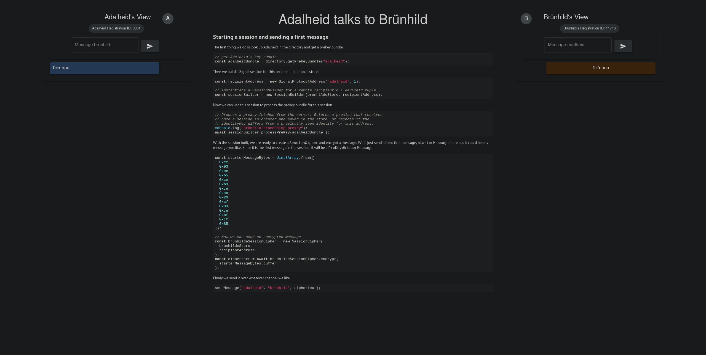
  <figcaption>Image caption</figcaption>
</figure>

Je met donc à jour ma spécification API, afin de coller à ce que j'ai vu dans l'exemple. La première chose que je vais faire est de renommer mon champ preKey en oneTimePreKey afin d'éviter les ambiguïtés.

## 2024-05-04

Aujourd'hui, je me suis occupé d'écrire la spécification pour la route `POST /users/{id}/messages`, qui permettra au serveur WebSocket de stocker les messages chiffrés pour un utilisateur, si son périphérique est déconnecté.

Je viens de me rendre compte qu'il sera nécéssaire de partager une clé entre l'API et le serveur WebSocket, afin de pouvoir vérifier les jetons JWT. Je vais donc passer sur un système de signature asymétrique, qui me permettra de signer les jetons JWT côté API avec une clé privée, et de les vérifier côté serveur WebSocket avec la clé publique. Je vais donc générer une paire de clés, et stocker la clé publique côté serveur WebSocket, et la clé privée côté API. Je dois également modifier le code afin de prendre en compte ce changement.

J'ai réussi à effectuer le changement. J'ai généré une paire de clés RSA256 avec OpenSSL, et j'ai stocké la clé privée et publique à la racine de `api`, bien évidemment ignorés avec .gitignore. J'ai rajouté la procédure pour générer ces dernières dans mon README. Maintenant, les JWT sont signés côté API grâce à la clé privée, ce qui améliore encore la sécurité de mon application, et il suffira juste d'utiliser la clé publique côté serveur WebSocket pour vérifier les jetons, ce qui évite de devoir partager une clé secrète entre les deux services. Je pense que ce changement est une bonne idée, car il permet de ne pas avoir deux potentiels points d'attaque, et de simplifier la gestion des clés.

Je devrais également regarder si il ne serait pas plus judicieux de faire la même chose pour le secret des cookies.

J'ai également créé une fonction dans le fichier utils afin de charger les clés publiques et privées, pour éviter de le faire sur chaque fichier. Je suis vraiment satisfait de ma progression aujourd'hui, et je m'attaquerais au serveur WebSocket demain.

Finalement, j'ai réglé un souci avec la version de Node, qui ne supportait pas le *globbing* afin de trouver les tests unitaires. J'ai donc dû mettre à jour la version de Node, et tout fonctionne correctement maintenant. J'ai également réglé quelques soucis dans les tests car je préfixe maintenant les routes avec `/v1` (afin de garder une version stable), ce qui n'était pas le cas avant.

## 2024-05-05

Aujourd'hui, je vais préparer le projet afin de pouvoir implémenter les WebSocket. Je me suis rendu compte que Fastify avait des fonctionnalités qui permettent d'avoir un serveur WebSocket sur la même application. Je vais donc restructurer le projet, afin de pouvoir bien séparer les différentes parties. Il serait je pense plus pratique d'avoir un dossier `api` et un dossier `websocket`, qui contiendront respectivement l'API et le serveur WebSocket.

Je vais maintenant implémenter les routes pour les messages, qui permettront de stocker les messages chiffrés pour un utilisateur, si son périphérique est déconnecté. Il faudra également implémenter une stratégie d'authentification différente, car les messages seront envoyés par le serveur WebSocket, et non par l'utilisateur. Comme défini dans ma spécification, une simple clé d'API au format UUID sera utilisée. Il me faut donc étendre mon plugin d'authentification pour supporter cette stratégie.

J'ai étendu mon plugin d'authentification afin de supporter différentes stratégies d'authentification. Je suis encore en train de réfléchir à comment stocker la clé d'API, que je pense simplement stocker dans une variable d'environnement (elle a seulement besoin d'être vérifiée).

Mes routes `GET users/{id}/messages` et `POST users/{id}/messages` fonctionnent désormais. J'ai dû effectuer des petits changements dans la base de données, notamment pour rajouter le contenu du message ainsi que changer le nom des champs afin qu'ils soient moins ambigüs. J'ai aussi reflété ces changements de base de données dans ma spécification OpenAPI. Il faudrait également donner un moyen au serveur de rajouter l'identifiant de l'envoyeur du message, ce qui n'est pas encore fait.

## 2024-05-08

Aujourd'hui, je m'attaque à la partie WebSocket. Fastify ayant son propre plugin WebSocket, j'ai décidé de l'utiliser pour plusieurs raisons pratiques:

- Il est intégré directement dans Fastify, ce qui me permet de ne pas avoir à gérer un autre serveur
- Il me permet de réutiliser ma stratégie d'authentification, ce qui me facilite énormément la tâche
- Il est bien documenté, ce qui me permet de ne pas perdre de temps à chercher comment l'utiliser

Je viens également de me rendre compte que si j'utilise le plugin WebSocket de Fastify, je n'aurais pas besoin d'avoir une route pour créer les messages temporaires: je pourrais simplement utiliser Prisma, mon ORM, afin de stocker les messages directement dans la base de données. Cela me permet également d'éviter d'utiliser une clé d'API, qui n'est plus nécéssaire. Le code devra donc être adapté afin de retirer cette dernière. J'aurais beaucoup aimé avoir trouvé ce plugin plus tôt, car il m'aurait évité de perdre du temps à implémenter des routes que je ne vais pas utiliser.

J'ai réussi à implémenter tout ça. J'ai été agréablement surpris de la facilité d'implémentation, ayant fait tout le code pour gérer les autorisations. C'est un plaisir de pouvoir tout réutiliser !

Pour l'instant, j'ai seulement implémenté une route exemple. Je m'occuperais de commencer à implémenter la logique de traitement des messages demain.

Il faudra également implémenter une validation au niveau du corps de la requête, pour s'assurer que les différentes requêtes envoyées par l'utilisateur•trice sont bien formées. Fastify intègre ça de manière assez élégante et native en Typescript, en utilisant des schémas JSON qui peuvent aussi servir de types. Voici [le lien vers la documentation](https://fastify.dev/docs/latest/Reference/TypeScript/) .

Apparemment, il est possible de générer un schéma JSON directement depuis Prisma, qui prend le schéma Prisma et créé un schéma JSON qui peut être utilisé pour valider les requêtes. Cela me semble être une bonne idée, car cela me permettra de ne pas avoir à réécrire les schémas de validation, et de m'assurer que les données envoyées par l'utilisateur•trice sont bien formées. Le souci étant que les requêtes, typiquement celle de connexion, n'est pas la même que le schéma de la base de données (il suffit de donner un nom et un mot de passe). Il faudra donc que je réfléchisse à comment je vais gérer ça. Voici [le lien vers la documentation](https://github.com/valentinpalkovic/prisma-json-schema-generator).

J'ai également refactor un peu mon application, et transformé mon client Prisma en plugin Fastify. Cela me permet de gérer l'instance de Prisma de manière beaucoup plus propre, ainsi que d'alléger les routes (mon client est maintenant importé une seule fois, et peut être utilisé partout dans l'application).

Finalement, j'ai aussi créé un Dockerfile de base, qui me permet de servir mon application facilement. Il y a encore quelques points de friction, comme un message `FATAL: database "prisma" does not exist". Il faudra que je m'en occupe plus tard. Également éviter de stocker le mot de passe de la base de données en clair dans le Dockerfile.

## 2024-05-09

Aujourd'hui, je me suis occupé de nettoyer un peu le code de certaines fonctions que je n'utilisais pas, et ait supprimé des importations inutiles. J'ai également supprimé la route `POST /users/{id}/messages`, qui n'est pas nécéssaire sachant que le serveur WebSocket peut interagir directement avec la base de données via Prisma. J'ai également mis à jour la spécification OpenAPI pour refléter ce changement, et je m'attaque maintenant à documenter tout ça. Ayant intégré un bon nombre de fonctionnalités, je vais m'occuper de documenter tout ça dans la page [Fonctionnement](./fonctionnement.md).

## 2024-05-11

Aujourd'hui, journée documentation. Je m'occupe de documenter le travail qui a été fait durant ces derniers jours, afin de s'assurer que tout soit bien clair. Je vais également commencer à réfléchir à un plan de tests.

J'ai également réussi à faire fonctionner un déploiement sur un VPS Amazon Lightsail à l'aide du `docker-compose.yml`. J'ai eu un peu de peine, car j'avais eu des soucis de versions, notamment liés au générateur automatique de fichier dbdiagram que j'avais mis en place, mais après être repassé sur le générateur Prisma par défaut, tout fonctionne. J'ai donc rajouté un reverse proxy sur le `docker-compose.yml` pour rediriger les requêtes vers le bon service.

## 2024-05-12

Aujourd'hui, j'ai travaillé sur l'envoi des messages entre différents utilisateurs. J'ai commencé par créer la connexion WebSocket en la stockant dans une Map qui contient en clé, l'id de l'utilisateur à qui elle appartient, et en valeur, la connexion WebSocket. Cela me permettra de directement envoyer des messages à un utilisateur spécifique si il est connecté.

Ensuite, j'ai implémenté la logique derrière l'envoi. Elle fonctionne comme ceci:

1. L'envoyeur envoie un message à un destinataire (après avoir vérifié son identité)
2. Le serveur vérifie si l'envoyeur est connecté
3. Si l'utilisateur est connecté, le serveur envoie le message directement au destinataire et informe l'envoyeur que le message a bien été reçu
4. Si l'utilisateur n'est pas connecté, le serveur stocke le message dans la base de données, et informe l'envoyeur du statut du message dès qu'il est stocké
5. Après stockage du message, le serveur WebSocket envoie une notification push au destinataire, qui lui permettra de récupérer le message. Le statut du message change également en "remis", et l'envoyeur est informé. (cette étape n'est pas encore implémentée)

<figure markdown="span">
  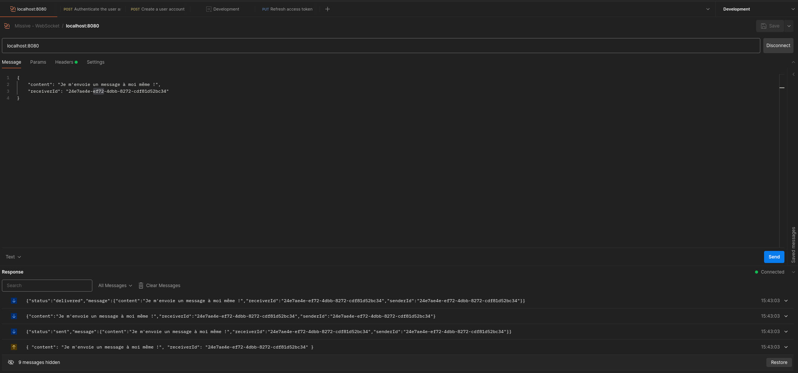
  <figcaption>Envoi d'un message à un utilisateur connecté via Postman</figcaption>
</figure>
<figure markdown="span">
  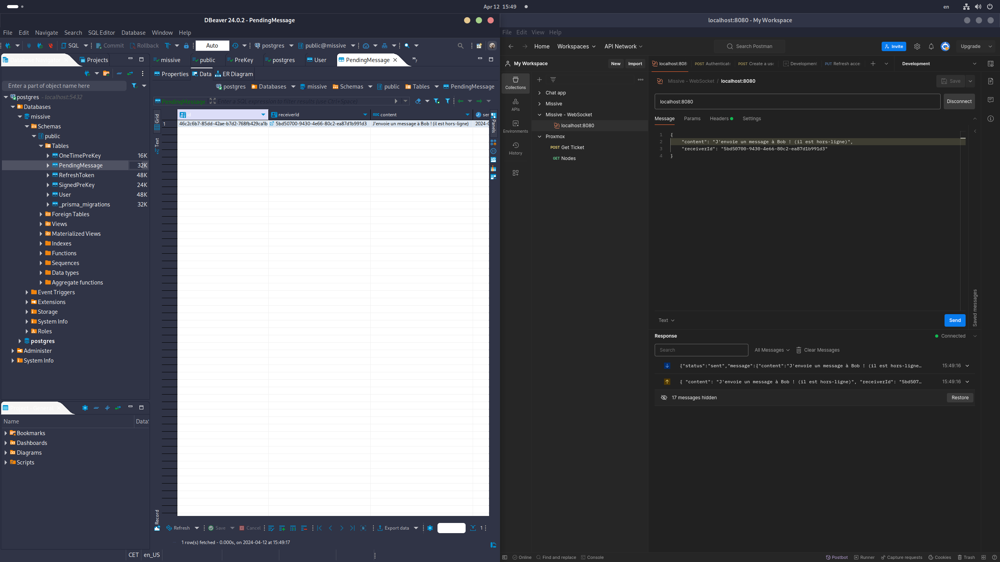
  <figcaption>Envoi d'un message à un utilisateur hors-ligne via Postman</figcaption>
</figure>
J'ai rencontré quelques soucis avec cette approche, et quelques points qui ne sont pour l'instant pas encore clairs:

- Si le destinataire récupère le message depuis la base de données, comment informer l'envoyeur que le message a bien été reçu ? En sachant que l'idée de base était de récupérer avec une route dédiée dans l'API, et non directement dans le serveur WebSocket.
- Si l'envoyeur envoie un message à un utilisateur et ferme ensuite son application, il y a une forte possibilité pour que le statut du message ne soit jamais mis à jour, car il compte sur la connexion WebSocket pour être informé du statut du message.

Je pense que ces deux problèmes pourront être réglés en ajoutant le statut du message dans la base de données. Cependant, il faudrait quand-même tester, car il est possible que cela ne soit pas suffisant.

## 2024-05-15

Aujourd'hui, je vais passer du temps sur la documentation. J'ai beaucoup avancé et après une discussion avec M. Garcia, il m'a fortement conseillé de commencer à la polir. Je vais donc m'occuper de tout ça. Vu qu'il était actuellement avec un élève, j'ai décidé de séparer mes déploiements Docker : Caddy ayant besoin d'un nom d'hôte différent et d'une configuration différente en développement (car il ne peut pas générer de certificat HTTPS depuis localhost), il m'a fallu séparer tout ça et créer un Caddyfile spécifique pour le développement. Tout a l'air de fonctionner maintenant, mais petit souci : quand je lance le docker compose pour la première fois, les migrations ne fonctionnent pas car il me semble que la base de données se lance toujours après le serveur, malgré les efforts que j'ai mis en place pour régler ce problème. Il faudra se pencher un peu plus sur ça.

Il faudrait :

- Mettre en place une architecture de documentation qui permette d'être imprimable facilement (tester avec mkdocs-with-pdf)
- S'assurer que l'application soit compatible avec les normes de protections de données en Suisse
- Faire un plan de tests solide

J'ai ajouté des paramètres VSCode afin de pouvoir garantir une impression standard du code, en enlevant tout ce qui n'est pas nécéssaire et non écrit par moi-même (node_modules etc.).

Je m'occupe maintenant de réaliser un plan de tests, que je vais effectuer tout d'abord sur Postman, et que j'inclurais ensuite dans ma documentation. Il faudra potentiellement des tests unitaires au niveau du code, mais il faut encore que je réfléchisse à ça.

J'ai rajouté un plan de tests dans ma documentation. J'ai également programmé quelques tests d'API dans Postman, mais il faudrait continuer demain afin d'avoir un *coverage* plus complet.

## 2024-05-16

Aujourd'hui, j'ai encore travaillé sur la documentation. J'ai rajouté des explications ainsi que des diagrammes sur le fonctionnement de l'API et du serveur WebSocket.

Maintenant, je suis en train de m'attaquer aux maquettes de l'application mobile, qui me permettront de mieux visualiser comment l'application va fonctionner. J'ai décidé de partir sur un design simple, qui reprend les éléments de base de ce qu'on attend d'une application de messagerie. J'ai également décidé de partir sur un design Material, qui est bien documenté et qui me permettra de gagner du temps. Il est aussi intégré directement dans Flutter.

## 2024-05-17

Aujourd'hui, j'ai continué à travailler sur les maquettes. Je commence à avoir quelque chose qui ressemble à ce que je veux, en ce qui concerne l'authentification et les conversations. Voici des captures d'écran des maquettes:
<figure markdown="span">
  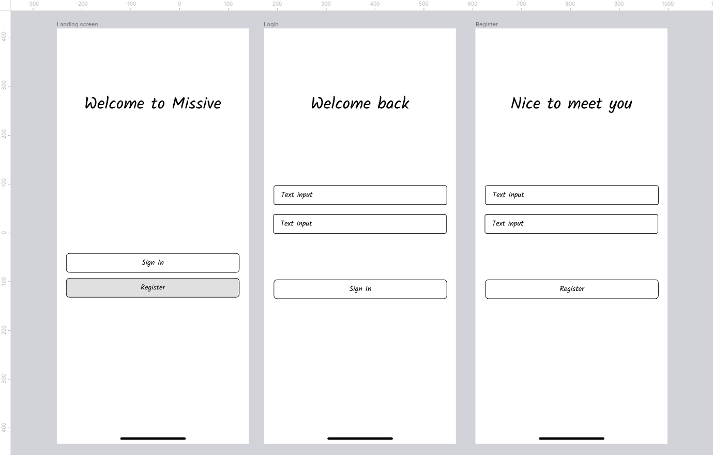
  <figcaption>Maquette de l'authentification</figcaption>
</figure>
<figure markdown="span">
  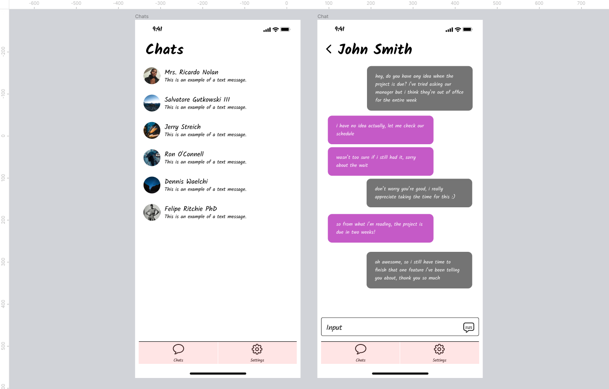
  <figcaption>Maquette des écrans de conversation</figcaption>
</figure>

Il me reste encore à m'occuper des maquettes de l'écran de paramètres. Accessoirement, je vais commencer à m'occuper de copier ce que j'avais sur le POC dans mon dossier `client`. Il est une bonne base sur laquelle j'avais passé beaucoup de temps, et j'aimerais bien pouvoir réutiliser ce que j'avais déjà fait.

Finalement, vers la fin de journée, j'ai adapté le client afin de fonctionner avec les nouvelles routes, et la nouvelle addresse, qui sont légèrement différentes. J'ai aussi simplifié le processus d'authentification et le stockage des jetons (j'ai finalement tout stocké dans le SecureStorage), et j'ai aussi changé isLoggedIn, qui vérifie juste si le refreshToken est défini dans le SecureStorage. Après de multiples tests, l'application fonctionne exactement comme mon POC, ce qui est très rassurant pour la suite.

Je pensais peut-être rééssayer Dio comme client HTTP afin de simplifier la gestion des requêtes, mais il faudrait que je regarde si j'aurais les mêmes erreurs que pendant le POC.

J'ai aussi pu commencer à implémenter mon client Signal: j'ai commencé par réfléchir à comment j'allais stocker tout ça, et Flutter a une excellente librairie, flutter_secure_storage, qui se connecte directement au stockage sécurisé de l'appareil.

J'ai donc décidé que j'allais stocker toutes ces données sensibles dans ce stockage sécurisé, sous forme de JSON. Si il y a un object à stocker, il sera sérialisé auparavant en base64.

Aujourd'hui j'ai pu implémenter une partie du PreKeysStore, qui va s'occuper de la gestion des clés publiques. La méthode storePreKey et loadPreKey ont l'air de bien fonctionner, après m'être pris la tête avec la sérialisation.

## 2024-05-18

Aujourd'hui, j'ai continué sur ma lancée avec l'implémentation du protocole Signal. Pour l'instant, j'ai rajouté un store complètement fonctionnel pour les clés d'identité, qui permet de stocker:

- Notre paire de clés d'identité
- Les clés publiques d'identité des autres utilisateurs

Il permet aussi de le stocker et de les retrouver de manière sécurisée, en utilisant le SecureStorage de Flutter. Il sérialise les objets en base64 (et ensuite en JSON si nécéssaire, dans le cas d'une liste ou d'un tableau de Maps), et les désérialise de la même manière. J'ai eu quelques soucis avec le flux de données, car l'implémentation des classes en Signal propose uniquement une sérialisation en UInt8List (liste d'entiers signés sur un octet), et non en String. J'ai donc dû rajouter pas mal de logique pour gérer tout ça.

Maintenant, après avoir continué à coder, je me suis rendu compte que je n'avais pas implémenté la fonctionnalité pour rafrâichir le jeton d'accès : j'ai donc décidé d'utiliser Dio à la place, qui est un autre client HTTP(S) en Dart. Il permet d'avoir une configuration globale, et de plus facilement gérer mes requêtes.

J'ai finalement réussi à implémenter le rafraîchissement automatique du jeton, en mettant la logique dans le getter accessToken. Cela me permet d'abstraire complètement le processus.

Je suis en train de m'occuper du stockage des pré clés, je viens de me rendre compte de quelque chose : il faudra également synchroniser les clés publiques avec le serveur. Il sera important de s'assurer que l'état entre le client et le serveur soit le même, car les clés publiques sont utilisées par un utilisateur qui souhaiterait nous envoyer un message, afin de réaliser son Diffie-Hellman. Il faudra donc implémenter une méthode qui permet de synchroniser les clés publiques avec le serveur, qui devra être appelée à chaque modification des clés publiques. Il faudra peut-être que ça fonctionne dans le cas où on perd la connexion.

Je viens de finir d'implémenter le store des pré clés signées. Il faudra maintenant tester un peu tout ça, voir si il est possible de chiffrer un message.

Je viens également de me rendre compte de quelque chose : au niveau du serveur, ma manière de stocker les clés publiques n'est pas bonne. En effet, pour une application Signal, il faut stocker ce qu'on appelle un "pre key bundle", qui contient :

- La clé publique d'identité
- La pré-clé publique signée
- La signature de la pré clé publique signée
- (optionnel) une pré clé à usage unique

Malheureusement, avec l'API que j'ai actuellement, il n'y a pas moyen de récupérer tout ça simplement. Il faudra donc que je réfléchisse à comment je vais gérer ça, potentiellement réorganiser certaines de mes routes. Je verrais tout ça demain.

Il faudra également aussi stocker le registrationID de l'utilisateur ainsi que son deviceID. Il est souvent recommandé de faire une table à part pour les appareils, mais je pense que pour l'instant, je vais sûrement le mettre dans la table des utilisateurs. Si on voudrait améliorer le système dans le futur et le rendre multi-appareils, il faudra réfléchir à le séparer.

## 2024-05-19

Aujourd'hui, je vais commencer à revoir un peu la manière dont fonctionne mon API. Il faut que je rajoute différents champs à la création de l'utilisateur :

- registrationID
- identityKey

Ces champs peuvent être stockés dans la table des utilisateurs. Je vais donc mettre à jour ma spécification OpenAPI, et mon schéma Prisma afin de refléter ces changements. J'aimerais implémenter :

- Une route pour créer un bundle de clés
- Une route pour récupérer un bundle de clés d'un utilisateur
- Une route pour effectuer la rotation des clés uniques

Je me suis également rendu compte qu'un setup avec plusieurs appareils rajouterait beaucoup trop de complexité. Nous allons donc assumer un ID de périphérique de 1 pour tous les utilisateurs, qui va simplifier énormément la tâche (ID utilisé dans la documentation du protocole Signal en Dart).

J'ai énormément travaillé ce matin. J'ai pu tout d'abord implémenter la page de création de compte, ce qui m'a obligé à faire une landing page pour l'application afin de pouvoir soit se créer un compte, soit se connecter.

Ensuite j'ai mis à jour ma spécification OpenAPI, mon schéma Prisma, ainsi que mon API pour prendre en compte les nouveaux champs. J'ai modifié la route pour créer le bundle de clés afin d'inclure tous les champs nécéssaires, j'ai modifié la route pour récupérer un bundle de la même manière. J'ai aussi réglé quelques problèmes de permissions qui étaient mal configurées (les utilisateurs n'avaient pas la permission `keys:write` par défaut).

J'ai aussi changé la manière dont je stockais les clés publiques dans le client Signal, afin de pouvoir stocker un bundle de clés, qui contient la clé publique d'identité, la clé publique signée, la signature de la clé publique signée, et une clé publique à usage unique. J'ai également rajouté un champ pour stocker le registrationID, qui est également nécéssaire pour notre implémentation.

Ensuite, j'ai fini par implémenter mon flow de création de compte au niveau du client. Il fonctionne de cette manière :

1. L'utilisateur rentre son nom d'utilisateur et son mot de passe
2. L'application génère une paire de clés d'identité, un registrationID, ainsi qu'une clé publique signée
3. L'application stocke les clés dans le SecureStorage
4. L'application envoie ces clés au serveur, qui les stocke (les clés publiques sont sérialisées, puis encodées en base64)

J'ai du créer un nouveau Provider, qui me permet de gérer ce processus de manière globale à l'application. Je pourrais également m'en servir quand j'aurais besoin de réactivité (quand on créé une session, par exemple).

## 2024-05-21

Aujourd'hui, j'ai pu me rendre compte de quelques soucis dans mon implémentation actuelle:

- Les différentes clés et données étaient et sont toujours mal stockées (elles ne sont pas sérialisées dans le SecureStorage, ce qui les rend impossible à récupérer)
- Mon API ne permettait pas de récupérer un bundle avec le nom d'utilisateur (ce qui est la seule donnée que l'on a à ce moment-là)

J'ai donc changé ma spécification OpenAPI afin de prendre en compte ces changements, et j'ai modifié mon API pour qu'elle prenne un nom d'utilisateur pour les clés. Au niveau du client, j'ai rajouté une méthode pour récupérer un bundle de clés. J'ai aussi du modifier mon implémentation de SignedPreKeys. Il faudra modifier les autres fichiers afin de tout bien stocker en base64 car sérialiser ne suffit pas, vu que SecureStorage ne prend que des chaînes de caractères. Les stocker juste en Uint8List ne permettrait donc pas de le déserialiser, car la représentation en chaîne de caractères est stockée et non les données en elles-mêmes.

J'ai quand même décidé de continuer à travailler sur la création de sesssions, avec une méthode de SignalProvider, buildSession. Cette dernière prend un nom d'utilisateur, un jeton d'accès et permet de créer une session chiffrée avec un autre utilisateur. Tout avait l'air de fonctionner, donc je suis passé sur la fonction d'envoi de message. C'est là que j'ai rencontré un problème : je n'arrivais pas à chiffrer le message, car j'avais énormément d'erreurs de type, et certaines valeurs manquantes.

Je me suis donc penché sur le problème, et j'ai réalisé que les sessions étaient mal sérialisées :

```dart
@override
  Future<void> storeSession(
      SignalProtocolAddress address, SessionRecord record) async {
    final sessions = await _getSessions();

    if (sessions == null) return;

    sessions[address.toString()] = base64Encode(record.serialize());

    await _secureStorage.write(key: 'sessions', value: jsonEncode(sessions));
  }
```

Je ne m'étais pas rendu compte de mon erreur, mais le `if (sessions == null) return;` empêchait de stocker les sessions si elles n'étaient pas déjà stockées. J'ai donc enlevé cette ligne, et initialisé une Map vide si les sessions n'étaient pas déjà stockées. J'ai également rajouté une méthode pour récupérer les sessions, qui permet de les désérialiser correctement.

Vu que la librairie est vraiment bien faite, après avoir implémenté toutes ces interfaces, il suffit juste de les passer dans le SessionBuilder, puis dans le SessionCipher pour chiffrer un message. La librairie s'occupe toute seule d'appeler les différentes méthodes afin de gérer l'état de la session.

J'ai testé la création de session avec l'utilisateur actuellement connecté, car je n'ai pas encore pu tester avec un autre utilisateur. Il me semble que tout fonctionne, je n'ai pas eu d'exceptions après avoir réglé le souci de sessions ! Il faudrait tester avec un autre utilisateur demain, afin de s'assurer que les clés soient les bonnes valeurs, car si ne serait-ce que l'une des clés est mauvaise, le déchiffrement ne pourra pas fonctionner.

## 2024-05-22

Aujourd'hui, je me suis attaqué à la connexion WebSocket quand l'utilisateur se connecte à l'application. J'ai pour cela commencé à créer un Provider qui me permet de gérer la communication en temps réel, et je me suis rendu compte que mon serveur WebSocket prenait malheureusement un ID au lieu d'un nom d'utilisateur. Il va donc falloir modifier ça, car il est seulement possible d'envoyer un message avec des données qu'on connaît déjà (l'ID est généré par le serveur, et n'est pas connu de l'utilisateur).

En tout cas, le lancement de l'application sur l'ordinateur de l'école marche correctement ! J'ai eu quelques soucis liés au cache de l'application qui était encore présent de l'ancienne version, mais après avoir tout nettoyé, tout fonctionne correctement. Il faudra rajouter de la gestion d'erreurs, car pour l'instant, l'application crash si on lui fournit un nom d'utilisateur qui n'existe pas à la récupération du bundle de pré clés.

J'ai réussi à faire fonctionner le chiffrement de bout-en-bout !! Voici une capture d'écran du processus en action:

<figure markdown="span">
  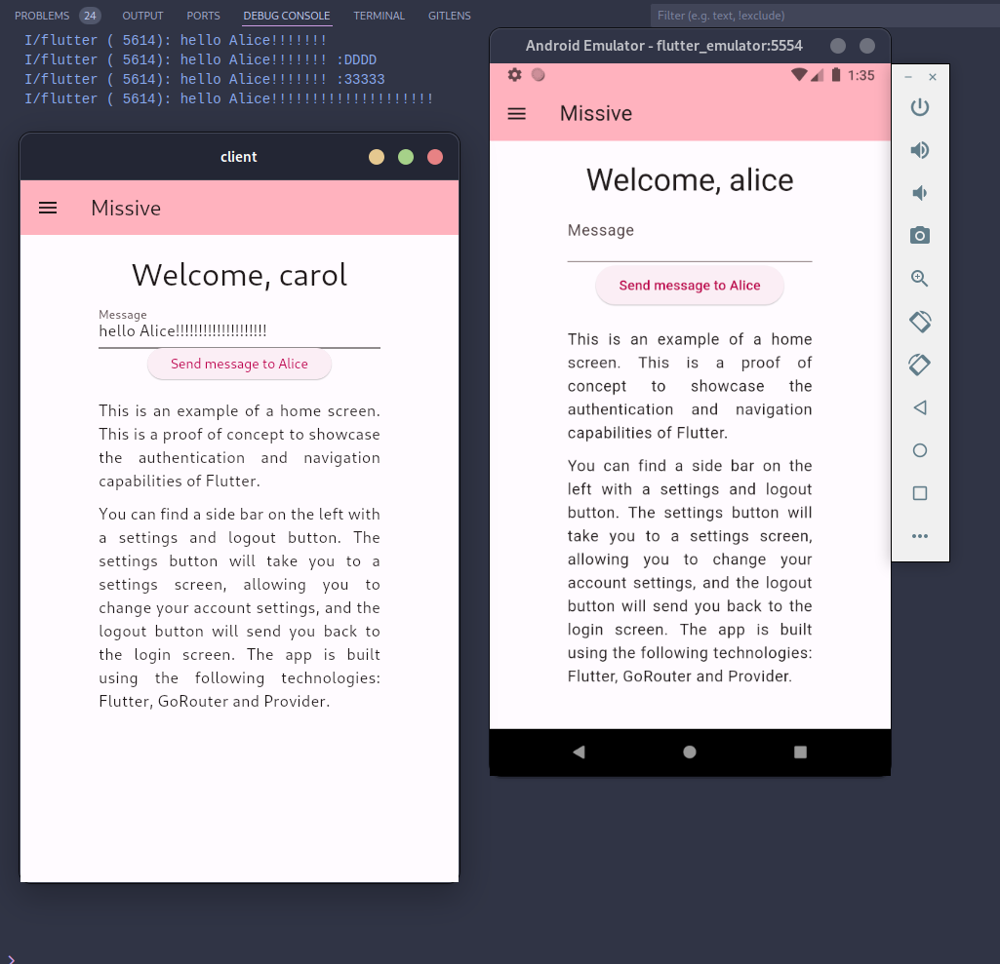
  <figcaption>Chiffrement de bout-en-bout</figcaption>
</figure>

Malheureusement, en essayant d'ajouter un StreamBuilder afin de visualiser le flux des messages en temps réel, je me suis heurté à un problème : ayant du marquer les variables en "late", ce qui signifie qu'elles seront initialisées plus tard dans le code, mon interface n'attend pas la connexion au WebSocket et crashe complètement. Il sera possible de régler ça avec un FutureBuilder, un widget qui permet d'attendre la fin d'un Future avant de construire le widget. Cela nous permettra aussi d'avoir un écran de chargement pendant le processus de génération des clés, ce qui sera beaucoup plus agréable et propre pour l'expérience utilisateur.

## 2024-05-23

Aujourd'hui, je me suis rendu compte de quelques soucis sur l'application :

- Quand on se déconnecte, puis se reconnecte à l'application, les clés peuvent changer dans le cas où l'utilisateur a créé un nouveau compte entre temps. Il faudrait potentiellement stocker toutes les clés des utilisateurs qui se sont déjà connectés, et utiliser les bonnes clés en fonction de l'utilisateur. Pour l'instant, ce n'est pas un problème car on teste sans jamais se déconnecter, mais cela serait une amélioration future cruciale. Il suffirait simplement d'implémenter la bonne logique dans les stores Signal.

J'ai réussi à faire fonctionner tout ça : j'ai simplement rajouté une classe, SecureStorageManager, qui fonctionne comme un FlutterSecureStorage mais qui rajoute un préfixe à chaque clé (le nom de l'utilisateur à qui les données appartiennent). Cela permet d'avoir plusieurs comptes connectés par périphériques, et à terme, de pouvoir gérer ces clés (si on veut les renouveller, les supprimer...). Cela a réglé un grand nombre de problèmes que j'avais, notamment les soucis à la déconnexion et la perte de l'état global. Je suis donc très content car tout fonctionne comme prévu ! J'ai aussi réglé la logique de déconnexion et de connexion, qui remet l'état de l'application à zéro si jamais le compte qui vient de se connecter est nouveau sur l'appareil.

Maintenant que tout fonctionne, il va falloir s'occuper du stockage des messages. En effet, le protocole Signal s'occupant uniquement du chiffrement, il va falloir trouver une solution pour persister les messages déchiffrés sur le périphérique.

Après avoir cherché un peu et étudié les différentes solutions, je pense partir sur Hive, qui est une implémentation d'une base de données NoSQL en Dart. Elle est rapide, simple d'utilisation, et permet également de créer des bases de données chiffrées. Je pense que stocker les messages dans le secure storage serait une assez mauvaise idée, car les requêtes pourraient rapidement devenir lentes et peu performantes. Il faudra donc que je réfléchisse à comment je vais gérer tout ça.

## 2024-05-24

Aujourdhui, j'ai commencé à m'occuper du stockage persistant des messages, qui pour l'instant sont seulement stockés dans la mémoire vive de l'application : l'idée est de tout stocker sur Hive à la réception d'un message, ou d'une mise à jour de statut, et de les chiffrer grâce au chiffrement qui est prodigué par Hive.

J'ai eu beaucoup de mal à comprendre comment le tout fonctionnait, et j'ai également pu régler quelques bugs, mettre un peu à jour l'apparence de l'application. Il faudra continuer à travailler sur ce stockage demain. J'ai eu des soucis de type, qui ont été quasiment réglés par l'utilisation de ce que Hive appelle un adapteur, qui permet de typer les données stockées dans la base de données. Malheureusement, en essayant de stocker directement mon message, je me suis heurté à un souci de cast qui ne fonctionnait pas bien. Il faudra que je réfléchisse à tout ça demain. J'ai trouvé [ce lien](https://github.com/isar/hive?tab=readme-ov-file#-bee-yond-the-basics-non-primitive-objects), qui explique comment stocker des objets non primitifs dans Hive, et je vais m'occuper d'implémenter tout ça demain.

## 2024-05-25

Aujourd'hui, ayant travaillé depuis la maison, j'ai passé la matinée à recréer mon environnement. C'est en faisant ça que je me suis rendu compte qu'il y avait quelques soucis avec ma configuration, notamment au niveau de la configuration du reverse proxy en développement : il écoutait les requêtes sur localhost, ce qui faisait qu'il était impossible d'y accéder depuis un autre appareil sur le réseau local. J'ai donc du modifier tout ça. Je me suis aussi heurté à quelques soucis au niveau de la configuration de mon environnement Flutter, notamment une configuration Gradle qui ne correspondait pas à la version de Java sur la machine. J'ai donc modifié tout ça.

J'ai aussi rajouté une configuration VSCode afin de pouvoir lancer les deux clients en même temps et en mode debug. J'ai aussi configuré le client afin d'utiliser des variables d'environnement, pour éviter de hard coder les valeurs de l'API.

On peut maintenant utiliser `--dart-define=API_URL=http://localhost:3000` pour changer l'URL de l'API, et `--dart-define=WEB_SOCKET_URL=ws://localhost:3000` pour changer l'URL du serveur WebSocket. Ces dernières sont déjà configurées dans le `launch.json`, afin de fonctionner avec un serveur qui est lancé en local.

J'ai réussi à régler les soucis de type avec Hive ! J'utilisais mal les génériques en Dart, car Hive ne supporte pas les génériques imbriquées pour le type de la Box. Le stockage fonctionne maintenant parfaitement !! Il me reste juste à l'implémenter pour l'envoi des messages, donc à la réception d'une mise à jour de statut. Il faudrait également récupérer les messages temporaires au démarrage de l'application, ainsi que de les stocker comme il faut. Il faudrait également résoudre le souci de la mise à jour des statuts dans le cas où l'une des deux personnes n'est pas connectée au WebSocket. Je pense qu'on pourrait le faire dès qu'un utilisateur se reconnecte au WebSocket, et de le stocker en base de données en attendant que l'autre se reconnecte, mais pour l'instant, ce n'est pas la priorité.

## 2024-05-26

Aujourd'hui, j'ai modernisé le look de mon application. J'ai essayé différentes palettes que j'ai généré grâce à ChatGPT, et j'ai finalement trouvé une palette qui me plaisait. J'ai donc changé les couleurs de l'application, et j'ai également mis à jour l'apparence de mes boutons, mes entrées texte afin d'avoir une apparence un peu plus agréable et fluide.

J'ai également implémenté le stockage des messages envoyés en local, dans la conversation du destinataire.

Il faudra également rajouter un ID au message, généré depuis le client, afin de pouvoir mettre à jour les statuts (envoyé, reçu, lu) de manière correcte. Il faudra également rajouter un champ pour stocker le statut du message, qui sera mis à jour en fonction des événements reçus du serveur WebSocket. Il faudra encore s'assurer que même si l'un des deux utilisateurs est déconnecté, le statut du message sera mis à jour au démarrage de l'application.

J'ai également rajouté un écran de chargement qui prend tout l'écran pendant le chargement des clés, afin de ne pas laisser l'utilisateur dans le flou, et de rendre le tout plus agréable à utiliser.

<figure markdown>
  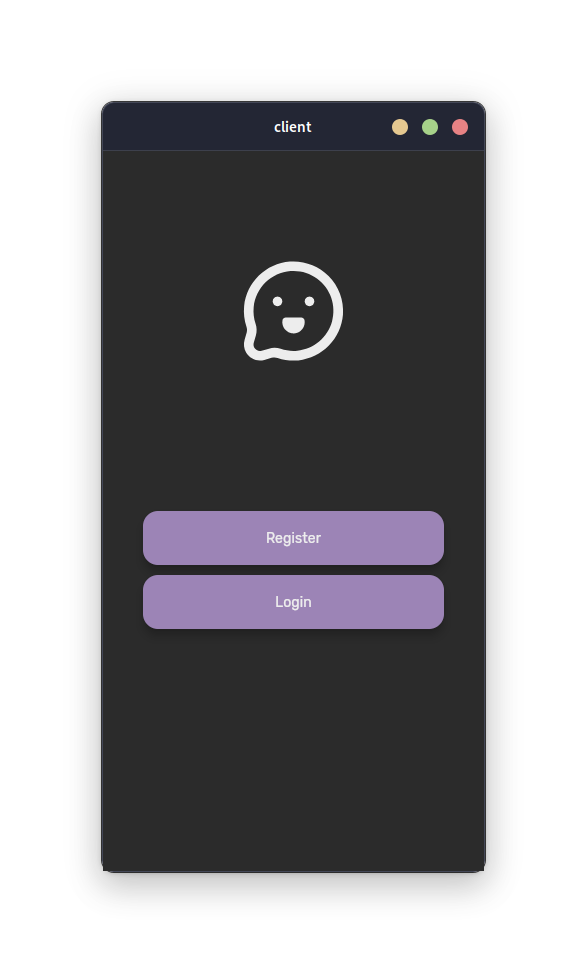{ width="400" }
  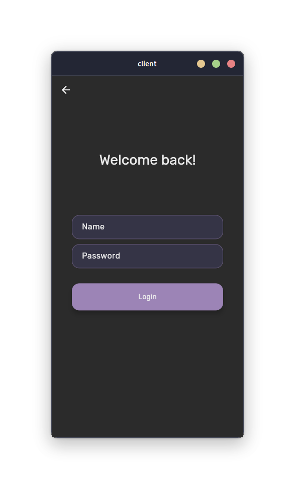{ width="400" }
  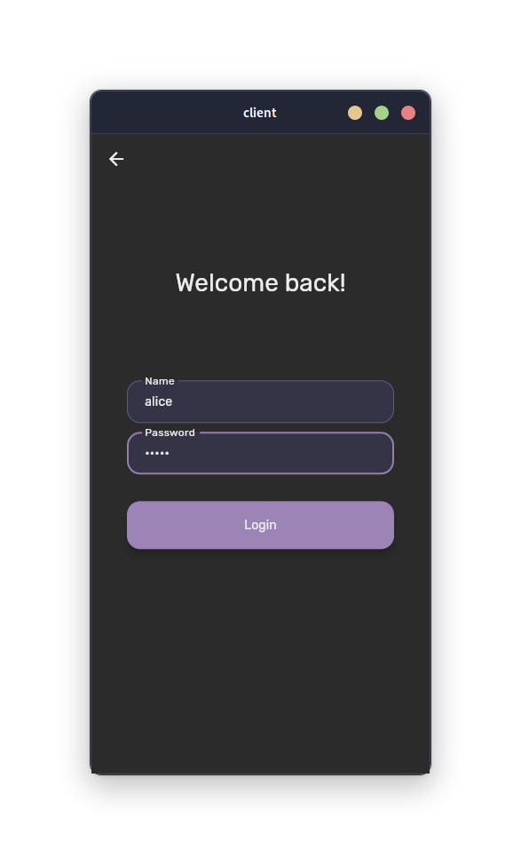{ width="400" }
  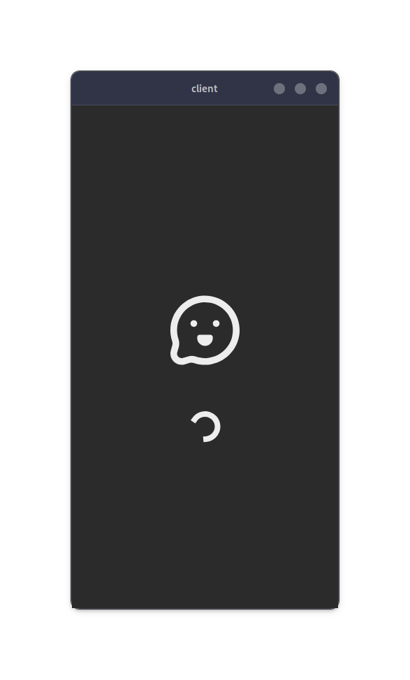{ width="400" }
  <figcaption>Captures d'écran de l'application</figcaption>
</figure>

## 2024-05-28

Aujourd'hui, j'ai procédé à un léger refactor de mes Provider : j'ai remarqué que l'interface était légèrement trop couplée avec la logique de mon application, et je n'aimais pas la manière dont on injectait AuthProvider dans ChatProvider. J'ai donc décidé de retirer les arguments qui dépendaient de AuthProvider, comme name, qui était le nom de l'utilisateur actuellement connecté, et j'ai décidé d'utiliser une fonctionnalité de Provider, ProxyProvider, qui permet d'utiliser d'autres providers dans un autre.

Cela me permet d'avoir une meilleure séparation des responsabilités, et de pouvoir directement dépendre de la valeur de AuthProvider sans avoir à la passer en argument, tout en conservant la réactivé de l'application. Cela retire encore un peu de complexité de l'interface, que j'aimerais garder la plus "pure" possible.

Finalement, j'ai pu régler un de mes derniers soucis : l'un de mes Provider utilisé dans ProxyProvider, ChatProvider, me donnait une erreur Flutter, car il était apparemment déjà "disposed", c'est-à-dire qu'il avait déjà été détruit. Je me suis donc rendu compte que je recrééais un Provider à chaque fois qu'il se mettait à jour, ce qui déclenchait cette erreur (on ne peut pas réutiliser un Provider déjà déconstruit en Flutter). J'ai donc créé des fonctions internes pour gérer les dépendances, et tout fonctionne comme avant maintenant !

## 2024-05-29

Aujourd'hui, j'ai réglé un souci que j'avais depuis l'implémentation du stockage des messages : quand on changeait de compte, on restait encore sur l'ancienne connexion WebSocket. C'était en fait dû à la manière dont j'initialisais Hive : je le faisais dans le initState de mon écran d'accueil, au lieu de le faire dans le main de l'application. J'ai donc déplacé tout ça, et tout fonctionne maintenant comme prévu.

J'ai aussi rajouté un ID au message généré depuis le client, afin d'avoir un moyen de mettre à jour les statuts des messages dans le futur.

J'ai également commencé à travailler sur l'interface des conversations. J'ai rajouté un Listenable dans mon ChatProvider, qui me permet de mettre à jour l'interface en temps réel quand on rajoute des messages dans la base de données locale.

Ensuite, je viens utiliser un widget Flutter, ValueListenableBuilder, qui permet de reconstruire le widget quand la valeur du Listenable change. Dans le cas de cette interface, le nom de l'utilisateur et son dernier message est récupéré. Cela me permet d'avoir une interface en temps réel, qui se met à jour dès qu'un message est reçu. Il faudra sûrement à terme modifier cette logique pour ne pas avoir à parcourir l'intégralité des messages à chaque fois, ce qui est extrêmement inefficace. Il faudrait idéalement trouver un moyen de stocker ces conversations (une liste de noms d'utilisateur ainsi que leur dernier message) quelque part dans la mémoire. Cela fonctionne pour l'instant, mais c'est une solution temporaire.

Il y a également un autre petit souci : quand on change de compte, l'historique complet des messages est perdu. Il faudra que je regarde pourquoi cela se produit-il, mais je suspecte une mauvaise gestion de la base de données (je ne préfixe pas la base de données avec le nom de l'utilisateur, ce qui écrase sûrement les messages de l'autre compte).

Le problème a été réglé ! Il a suffit de rajouter un champ qui contient le nom de l'utilisateur dans mon ChatProvider, un ValueListenable ne pouvant pas être asynchrone (il ne peut donc pas récupérer directement le nom depuis AuthProvider). Je le récupère ensuite depuis ma méthode connect(), qui en plus d'initialiser la connection WebSocket initialise le nom afin d'être utilisé par Hive. Mes messages sont donc stockées dans la base `$name_messages`, ce qui permet de ne pas écraser les messages de l'autre utilisateur, et d'avoir une clé de chiffrement différente pour chaque utilisateur, et permet d'encore plus isoler les messages des différents comptes connectés sur l'appareil.

## 2024-05-30

Aujourd'hui, j'ai décidé de m'attaquer à la création d'un écran afin de pouvoir consulter une conversation, et de pouvoir envoyer des messages. Malheureusement, je me suis heurté à un problème : je me suis rendu compte que Hive, la base de données que j'utilise, ne supporte pas la pagination, ce qui veut dire que l'intégralité des messages est chargée en mémoire à chaque fois. Cela peut poser problème si l'utilisateur a beaucoup de messages, et peut ralentir énormément l'application.

J'ai donc cherché une autre solution de base de données, et j'ai vu que sqflite avait un support pour la pagination, et le chiffrement avec sqflite_cipher. Malheureusement, ce dernier fonctionne seulement avec Android et iOS. Je ne peux donc pas l'utiliser car l'application doit fonctionner également sur Linux / Windows / macOS.

Après avoir effectué mes recherches, j'ai découvert Realm, une solution de base de données locale NoSQL publiée par MongoDB. Elle est rapide (les objets sont *lazy loaded*), simple d'utilisation, et supporte le chiffrement. Elle est également multi-plateforme, ce qui est un énorme avantage pour moi. J'ai donc décidé de l'implémenter dans mon application. Je vais effectuer des tests aujourd'hui pour voir si elle correspond à mes besoins.

J'ai finalement réussi à tout passer sur Realm ! J'ai même pu gagner en performance par rapport à Hive, grâce au *lazy loading*. Je me charge maintenant de créer l'écran de conversation.

J'ai créé un composant MessageBubble qui me permet d'afficher les messages de manière agréable. J'ai réussi à récupérer tous les messages comme il faut, et à les afficher dans l'ordre. Il faudra maintenant que je m'occupe d'ajouter une boite de texte pour envoyer des messages, ainsi que d'afficher l'heure de réception des messages.

## 2024-06-01

J'ai réussi à implémenter l'écran de conversations sans aucun problèmes aujourd'hui. Il m'a suffit de rajouter un TextField pour envoyer des messages, et de rajouter un bouton pour envoyer le message. La communication a fonctionné directement de manière fluide et bidirectionnelle, ce qui est très rassurant pour la suite.

Il faudrait maintenant réfléchir à un moyen de trouver comment envoyer le premier message, car il n'y a pas de liste de contacts pour l'instant. Je pensais rajouter un bouton en haut à droite de l'écran d'accueil afin de pouvoir taper un nom d'utilisateur et envoyer un message directement. Ce n'est pas la solution la plus pratique, il faudrait idéalement avoir une liste de contacts quelque part ainsi que la possibilité d'ajouter un utilisateur en tant que contact / ami.

## 2024-06-02

Aujourd'hui, je vais commencer à implémenter une recherche d'utilisateurs. J'aimerais avoir une barre de recherche, qui permet de rechercher un utilisateur par son nom. Tout d'abord, je vais implémenter une simple route à GET /users qui permet de récupérer tous les utilisateurs, puis je vais rajouter un paramètre de recherche qui permet de filtrer les utilisateurs par leur nom.

J'ai réussi à implémenter cette recherche. J'ai rajouté ma route `GET /users`, qui permet de récupérer le nom des utilisateurs que l'on recherche (sauf l'utilisateur connecté, pour éviter de pouvoir s'envoyer des messages à soi-même). J'ai également rajouté un paramètre `search` qui permet de filtrer les utilisateurs par leur nom.

Ensuite, j'ai créé une page qui permet de rechercher un utilisateur, et à chaque fois que l'on tape quelque chose dans la barre de recherche, une requête est envoyée au serveur pour récupérer les utilisateurs correspondants (j'ai mis un timeout de 500ms avec une classe Debouncer, qui prend un temps en millisecondes et qui empêche de pouvoir être lancée avant la fin de ce timer). Quand on clique sur l'utilisateur auquel on souhaite envoyer un message, une session est créée avec lui grâce au SignalProvider, et l'écran de conversation est affiché.
<figure markdown>
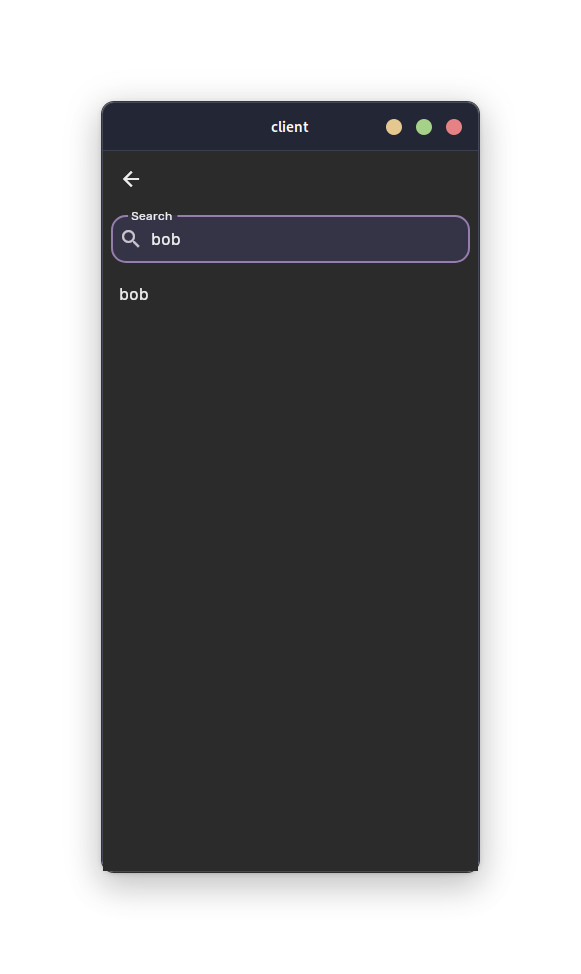
<figcaption>Écran de recherche</figcaption>
</figure>

Maintenant que la communication initiale peut être établie au niveau de l'interface, j'aimerais m'occuper de la récupération des messages temporaires au démarrage de l'application. Je pense rajouter une méthode dans mon ChatProvider, qui permet de récupérer ces messages, créer une session au besoin, et les stocker dans la base de données locale.

J'ai aussi réglé un bug assez gênant qui faisait qu'un utilisateur s'envoyait un message à lui-même au premier message. Ce bug était causé par le fait que Flutter ne disposait pas du ChatProvider après le logout, car on ne le recréeait pas. J'y ai passé énormément de temps, ça m'a pris toute la journée, mais j'ai finalement réussi à régler le problème en retournant un nouveau ChatProvider quand le statut isLoggedIn devient false, dans mon update. Tout fonctionne maintenant !

## 2024-06-03

Aujourd'hui, j'ai principalement passé du temps sur quelques fioritures au niveau de la page de conversation. J'ai rajouté des timestamps pour chaque message, si ils sont séparés de plus de 5 minutes, ou la date complète si ils sont séparés de plus de 24 heures. Je me suis également occupé de créer un poster pour l'application, qui sera utilisé pour la présentation de mon projet. Voici à quoi il ressemble pour l'instant :

<figure markdown>
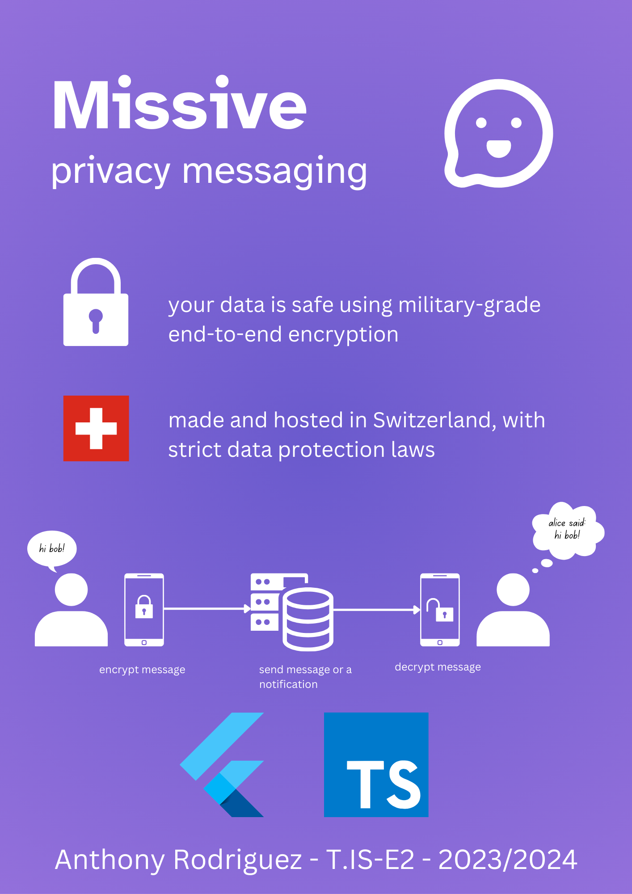{ width="500" }
<figcaption>Poster de Missive</figcaption>
</figure>

## 2024-06-05

Aujourd'hui, je me suis concentré sur la documentation de mon code. Dart possède une fonctionnalité très intéressante, les docstrings, qui permettent de documenter le code de manière très simple et efficace. J'ai donc passé la journée à documenter tout mon code, afin de pouvoir le rendre plus lisible et compréhensible. Il est également possible de générer une documentation en ligne à partir de ces docstrings, ce qui permet de rendre le tout encore plus accessible, et de le publier sur un site internet. Je vais m'en servir pour générer la documentation API de mon client.

## 2024-06-06

Aujourd'hui, vu que le code est bien avancé, je suis en train de me concentrer sur la partie DevOps du projet. Je suis en train d'implémenter des tests unitaires pour le client, en priorisant pour l'instant le test des fonctionnalités de chiffrement et de déchiffrement.

En parallèle, j'ai commencé à regarder comment je pourrais implémenter les notifications Push sur l'application. J'ai trouvé un service, nommé [OneSignal](https://onesignal.com/), qui permet de gérer les notifications Push sur Android et iOS de manière très simple. Il suffit de rajouter un SDK dans l'application, et de configurer le serveur pour envoyer des notifications. J'ai commencé à implémenter tout ça, et j'ai réussi à envoyer une notification depuis le serveur, qui est bien reçue par l'application. Il faudra maintenant que je rajoute un champ `oneSignalId` dans la base de données, qui permettra de stocker l'ID de l'utilisateur sur OneSignal, et de lui envoyer des notifications.

Il faudra également mettre à jour la base de données après la connexion / déconnexion, un ID OneSignal appartenant à un seul périphérique en même temps (sachant qu'on ne peut avoir qu'un compte connecté en même temps). Il faudra donc mettre à jour ma route `PUT /users/{id}` pour mettre à jour ce champ.

Pour l'instant, je me suis remis sur les tests unitaires car c'est la priorité pour l'instant. Je regarderais plus tard cette histoire de notifications, car il faudra également implémenter les reçus de messages.

J'ai un petit souci avec mon gitlab CI : la documentation ne se met pas à jour automatiquement. Il faudra que je regarde pourquoi, car c'est un peu embêtant pour le moment. Je pense que c'est lié au fait qu'elle soit un submodule, donc je ne peux pas vérifier le contenu de ce dernier comme je le ferais pour un dossier.

J'ai trouvé comment faire ! Il me suffisait simplement de tester les changements sur le nom du submodule, au lieu de son contenu. Voici un exemple fonctionnel :

```yml
rules:
  - changes:
    - documentation
```

## 2024-06-07

Aujourd'hui, j'ai encore avancé sur la documentation. J'ai mis à jour la page fonctionnement, et passé beaucoup de temps sur le poster afin de s'assurer qu'il serait prêt pour la présentation. J'ai également commencé à travailler sur la mise à jour des statuts de message, qui permettra de savoir si un message a été envoyé, reçu, ou lu.

J'ai rajouté un modèle MessageStatus dans mon modèle Prisma, lié au modèle PendingMessage. Il faudra maintenant implémenter au niveau des routes, et j'ai également rajouté une route `GET /messages/{id}/status` qui permet de récupérer le statut de tous les messages. Quand on récupère les messages au lancement de l'application, il faudra également rajouter la mise à jour des statuts de ces messages afin que l'envoyeur soit au courant de l'état de ses messages. Il faudra aussi s'occuper de le faire via le WebSocket, si l'autre utilisateur est connecté.

## 2024-06-08

Aujourd'hui, j'ai pu implémenter la mise à jour des statuts de messages. J'ai rajouté la route qui récupère les statuts des messages que l'utilisateur connecté a envoyé, et j'ai modifié ma route WebSocket afin de mettre à jour automatiquement les statuts à l'envoi (envoi direct si en ligne, sinon stockage temporaire).

Au niveau du client, j'ai rajouté un champ `status` dans mon modèle `PlaintextMessage`, qui me permet de stocker ce dernier et de le mettre à jour en temps réel dans l'interface. Vu que Realm rend ça très simple et réactif, il m'a juste suffit de rajouter les bonnes icônes dans mon widget `MessageBubble`. Il ne me restera plus qu'à implémenter le statut "lu", qui sera un peu plus complexe à implémenter, sachant que ma route WebSocket devra gérer en plus d'un envoi de message classique, l'envoi d'une mise à jour de statut.
