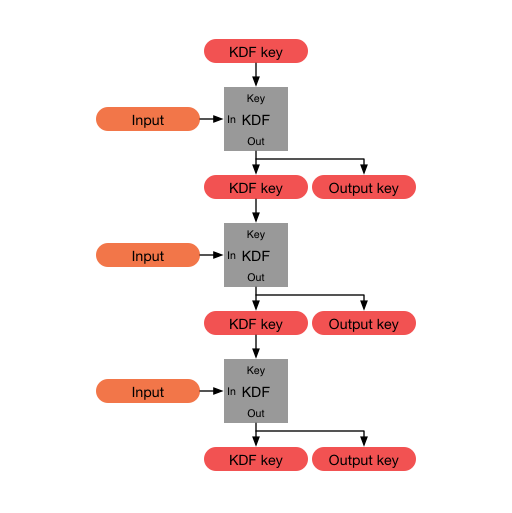
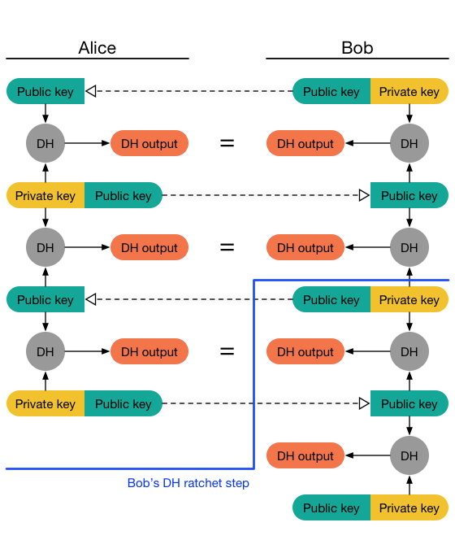

# Le protocole Signal

Le protocole Signal est un ensemble de protocoles que l'application éponyme utilise afin de pouvoir développer une application de messagerie sécurisée. Il est libre d'accès, et implémentable dans n'importe quel langage de programmation. Il définit des concepts aussi bien au niveau du client qu'au niveau du serveur. Le choix de ce protocole a en grande partie été justifié par son accessibilité (tous les documents de la fondation sont disponibles librement), sa documentation extensive, ainsi que ses multitudes d'implémentation dans un grand nombre de langage par différentes entreprises de sécurité informatique.

## Concepts importants

Avant de parler du fonctionnement du protocole dans son ensemble, il est nécéssaire de revenir sur quelques concepts qui forment la base de ce dernier.

### Diffie-Hellman

Avant d'expliquer ce qu'est X3DH, qui est une partie importante du protocole Signal, il est nécéssaire de bien comprendre comment l'algorithme de Diffie-Hellman fonctionne.
Ce dernier est un algorithme permettant de générer des clés partagées qui sont les mêmes, ce qui permet d'attester de l'identité des utilisateur·rice·s qui communiquent. Cette clé partagée est formée en mélangeant la clé publique signée de l'envoyeur (précédemment envoyée sur le serveur), et la clé privée du destinataire. L'opération est ensuite réalisée en sens inverse. Cet algorithme génère une clé qui sera la même pour les deux utilisateur·rice·s, et qui permet d'attester de l'identité de l'autre utilisateur·rice. Cette clé partagée sera ensuite affichée sur la conversation pour que les deux utilisateur·rice·s puissent attester de l'identité de l'autre si le besoin se présente.
<figure markdown>
{ width=400 loading=lazy }
<figcaption>Schéma d'un échange Diffie-Hellman</figcaption>
</figure>

### X3DH (Extended Triple Diffie-Hellman)

Maintenant que nous avons expliqué Diffie-Hellman, nous allons nous intéresser à XD3H, qui est une partie importante du protocole Signal. Ce dernier reprend les mêmes concepts que Diffie-Hellman, mais génère une série de valeurs au lieu d'une seule clé partagée. Il est plus adapté aux contextes asynchrones, et permet de gérer automatiquement les cas où le destinataire serait hors-ligne, ou aurait son périphérique éteint.

Il fonctionne exactement de la même manière, mais utilise des valeurs différentes dont nous allons parler plus tard. X3DH récupère d'abord un bundle de pré-clés dont le contenu sera expliquée plus bas, et l'utilise pour générer 4 valeurs Diffie-Hellman, qui sont ensuite regroupées pour calculer une clé partagée secrète. Elle a le même but que Diffie-Hellman, à savoir établir un accord entre les deux utilisateur·rice·s, mais elle a l'avantage de contenir des clés éphémères (certaines des clés privées sont mêmes supprimées après utilisation), et permet d'encore renforcer la sécurité dans le cas où une des clés serait compromise.

### Algorithme à *double ratchet*

Finalement, l'un des éléments clés de ce protocole est la manière dont les messages sont chiffrés tout au long des conversation. Il fonctionne avec ce qu'on appelle un algorithme à *double ratchet* (roue à rochet / crantée) : il s'agit d'un algorithme  qui permet de chiffrer les messages de bout en bout depuis une clé initiale après vérification d'identité mutuelle (protocole X3DH), et ensuite en utilisant une partie du message précédemment envoyé afin de s'assurer que si une des clés est compromise, les autres messages restent confidentiels.

<figure markdown>
{ width=300 loading=lazy }
<figcaption>Exemple d'une roue à rochet</figcaption>
</figure>
Il utilise ce qu'on appelle une chaîne KDF, une fonction cryptographique qui, en prenant une clé secrète, une clé aléatoire, et une chaîne de caractères quelconque, va générer du contenu chiffré (algorithme de chiffrement symmétrique). La spécificité de cette fonction de chiffrement se trouve dans sa capacité à être chaînée ; en plus de chiffrer le contenu avec la clé secrète, elle va également utiliser une partie de la sortie pour chiffrer le message suivant. Cela permet de s'assurer que si une des clés est compromise, les messages précédents restent confidentiels (d'où le *ratchet*, la chaîne ne va que dans un seul sens).
<figure markdown>
{ width=500 loading=lazy }
<figcaption>Schéma explicatif du fonctionnement de la chaîne KDF</figcaption>
</figure>
Cette approche comporte cependant un problème : si un attaquant venait à intercepter l'une des clés, il pourrait décrypter tous les messages suivants. C'est ici que la partie *double* du nom *double ratchet* intervient : l'algorithme combine la clé symmétrique générée précédemment avec l'algorithme de chaîne KDF (premier rochet), avec un second rochet Diffie-Hellman. Il fonctionne de la manière suivante :

- Pour l'initialisation, une paire de clés Diffie-Hellman est générée de chaque côté
- Le premier message est envoyé avec la clé publique de l'envoyeur dans l'entête du message
- A la réception du message par le destinataire, sa clé privée est utilisée avec la clé publique de l'envoyeur pour générer une nouvelle paire Diffie-Hellman (qui sera donc égale pour les deux)
- Quand le destinataire souhaite répondre, il envoie sa clé publique dans l'entête du message

Le processus se répète pour chaque message, et assure que les deux clés soient les mêmes à tout moment.

<figure markdown>
{ width=500 loading=lazy }
<figcaption>Schéma explicatif du fonctionnement du second rochet</figcaption>
</figure>

## Fonctionnement général

### Génération des clés

Après avoir installé l'application, la première étape du protocole est de générer une liste de clés, qui seront utilisées pour vérifier l'identité de l'utilisateur·rice, et d'informer les autres utilisateur·rice·s de sa présence sur le serveur. Ces clés sont les suivantes :

- Une paire de clés d'identité (privée / publique)
- Une pré-clé signée (publique)
- Plusieurs pré-clés non signées

Les clés publiques sont ensuites publiées sur le serveur.
